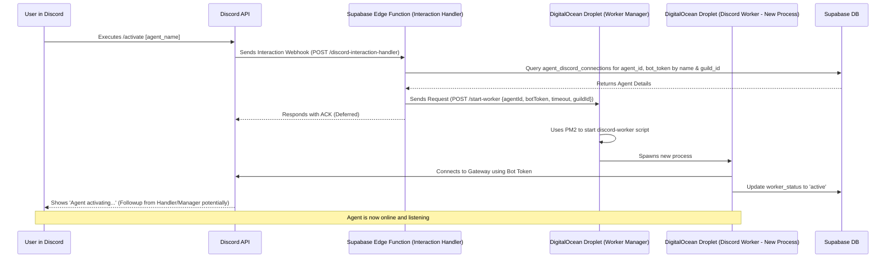

# Agentopia - Discord Bot Integration

Agentopia allows users to create, configure, and manage AI agents via a web UI. This specific project focuses on integrating these agents with Discord, enabling them to be activated and interact within Discord servers using slash commands and mentions.

## Table of Contents

- [Project Overview](#project-overview)
- [Project Structure](#project-structure)
- [Key Components](#key-components)
- [Deployed Endpoints & Services](#deployed-endpoints--services)
- [Core Workflows](#core-workflows)
  - [Agent Activation Flow](#agent-activation-flow)
  - [Agent Message Handling Flow](#agent-message-handling-flow)
- [Development & Setup](#development--setup)

## Project Overview

*   **Goal:** Provide a platform for creating AI agents that can operate within Discord.
*   **Core Technologies:** React/Vite (Frontend), Supabase (Database, Auth, Edge Functions), Node.js/Express (Backend Services), Discord.js, DigitalOcean (Droplet for Backend Services).
*   **Key Features:**
    *   Web UI for agent creation and configuration.
    *   Discord integration setup (Bot Token, App ID, etc.).
    *   `/activate` slash command to bring agents online in a server.
    *   Agent responses when mentioned (`@AgentName`).
    *   Management of agent worker processes.

## Project Structure

```
.
├── .cursor/              # Cursor AI configuration/rules
├── .git/                 # Git repository data
├── docs/                 # Project documentation (protocols, context, checklists)
├── node_modules/         # Node.js dependencies (managed by package.json)
├── scripts/              # Utility scripts
├── services/             # Backend microservices (run on DigitalOcean Droplet)
│   ├── discord-worker/   # Node.js process that connects to Discord Gateway as a specific agent
│   └── worker-manager/   # Node.js/Express service to manage/launch discord-worker instances (uses PM2)
├── src/                  # Frontend source code (React/Vite)
│   ├── components/       # Reusable UI components
│   ├── contexts/         # React contexts (e.g., Auth)
│   ├── hooks/            # Custom React hooks
│   ├── lib/              # Library initializations (e.g., Supabase)
│   ├── pages/            # Page components (e.g., AgentEdit, Dashboard)
│   └── types.ts          # Shared TypeScript type definitions for frontend
├── supabase/             # Supabase specific files
│   └── functions/        # Supabase Edge Functions
│       ├── discord-interaction-handler/ # Handles incoming interactions (commands, autocomplete) from Discord
│       ├── register-agent-commands/     # (Likely) Registers slash commands with Discord
│       └── chat/                        # (Likely) Handles generating agent responses
├── utils/                # General utility functions (shared across project if needed)
├── .env                  # Root environment variables (primarily for frontend/Vite)
├── .gitignore            # Git ignore rules
├── eslint.config.js      # ESLint configuration
├── index.html            # Main HTML entry point for Vite frontend
├── package-lock.json     # NPM dependency lock file
├── package.json          # Project dependencies and scripts
├── page.tsx              # (Likely) Root frontend component or entry point
├── postcss.config.js     # PostCSS configuration (for Tailwind)
├── README.md             # This file
├── tailwind.config.js    # Tailwind CSS configuration
├── tsconfig.app.json     # TypeScript config for the frontend app
├── tsconfig.json         # Base TypeScript configuration
├── tsconfig.node.json    # TypeScript config for Node.js parts (services)
└── vite.config.ts        # Vite build tool configuration
```

## Key Components

*   **Frontend (`src/`):**
    *   Built with React, Vite, and TypeScript.
    *   Styled with Tailwind CSS.
    *   Hosted on Netlify.
    *   Allows users to log in (via Supabase Auth), create/edit agents (name, personality, instructions), and configure Discord connection details (Bot Token, App ID, Public Key, timeout).
    *   Interacts with the Supabase database via the Supabase JS client.
*   **Supabase Backend (`supabase/`):**
    *   **Database:** Stores agent configurations, Discord connection details, user data, worker status, etc.
    *   **Authentication:** Handles user login/signup.
    *   **Edge Functions:** Serverless functions for handling specific backend tasks.
        *   `discord-interaction-handler`: Receives HTTPS requests from Discord for interactions (slash commands like `/activate`, autocomplete requests). Verifies request signatures, fetches data from Supabase DB, and calls the `worker-manager` service.
        *   `register-agent-commands`: (Presumed) Responsible for registering the `/activate` command with Discord's API for specific agents/guilds.
        *   `chat`: (Presumed) Contains the logic for generating an agent's response when it's mentioned, likely involving calls to an LLM API (e.g., OpenAI).
*   **Backend Services (`services/`):**
    *   Designed to run persistently on a separate server (DigitalOcean Droplet).
    *   Written in Node.js and TypeScript.
    *   **`worker-manager`**:
        *   An Express.js API service.
        *   Listens for requests from the `discord-interaction-handler` Edge Function (on port 8000 by default).
        *   Manages the lifecycle of `discord-worker` processes using PM2.
        *   Receives agent details (ID, token, timeout) and spawns a dedicated `discord-worker` process.
    *   **`discord-worker`**:
        *   A Node.js process spawned by the `worker-manager`.
        *   Connects to the Discord Gateway using a specific agent's bot token.
        *   Listens for mentions of the agent within Discord channels.
        *   Calls the Supabase `chat` function to get responses.
        *   Handles inactivity timeouts (shuts down if inactive).
        *   Updates its status (`active`, `inactive`, `terminating`) in the Supabase database.

## Deployed Endpoints & Services

*   **Git Repository:** `[Your Git Repository URL]` (Please update this link)
*   **Frontend (Netlify):** [`https://agentopia.netlify.app/`](https://agentopia.netlify.app/)
*   **Worker Manager (DigitalOcean):** `http://165.22.172.98:8000` (Note: Runs on a Droplet, IP: `165.22.172.98`, Port: `8000`)
*   **Supabase Project:** `[Your Supabase Project Dashboard URL]` (Contains Database, Auth, Edge Functions)

## Core Workflows

### Agent Activation Flow

This diagram shows how the `/activate` command brings an agent online.



### Agent Message Handling Flow

This diagram shows how an agent responds when mentioned in Discord.

```mermaid
sequenceDiagram
    participant User in Discord
    participant Discord API / Gateway
    participant DigitalOcean Droplet (Discord Worker)
    participant Supabase Edge Function (Chat)
    participant LLM API (e.g., OpenAI)
    participant Supabase DB

    User in Discord->>Discord API / Gateway: Sends message mentioning @AgentName
    Discord API / Gateway->>DigitalOcean Droplet (Discord Worker): Forwards MESSAGE_CREATE event
    DigitalOcean Droplet (Discord Worker)->>Supabase Edge Function (Chat): Calls function with message content, context, agent details
    Supabase Edge Function (Chat)->>Supabase DB: (Optional) Fetch agent personality, history
    Supabase DB-->>Supabase Edge Function (Chat): Return data
    Supabase Edge Function (Chat)->>LLM API (e.g., OpenAI): Request completion based on prompt
    LLM API (e.g., OpenAI)-->>Supabase Edge Function (Chat): Returns generated response
    Supabase Edge Function (Chat)-->>DigitalOcean Droplet (Discord Worker): Returns response text
    DigitalOcean Droplet (Discord Worker)->>Discord API / Gateway: Sends response message to channel
    Discord API / Gateway->>User in Discord: Displays agent's message
```

## Development & Setup

To set up and run this project locally for development purposes, follow these steps:

**Prerequisites:**

*   **Node.js:** (Version 18.x or later recommended) - Download from [nodejs.org](https://nodejs.org/)
*   **npm:** (Usually included with Node.js)
*   **Git:** For cloning the repository.
*   **Supabase Account:** Required for the database, auth, and edge functions. Get started at [supabase.com](https://supabase.com/).
*   **Supabase CLI:** (Optional but recommended for local function development) Install via npm: `npm install supabase --save-dev` or follow [official instructions](https://supabase.com/docs/guides/cli).
*   **Discord Application & Bot:** You'll need a Discord application with a bot user created. Find instructions in the [Discord Developer Portal](https://discord.com/developers/docs/intro).

**1. Clone the Repository:**

```bash
git clone [Your Git Repository URL] # Replace with actual URL
cd [repository-directory-name]
```

**2. Install Dependencies:**

Install dependencies for the root (frontend), worker-manager, and discord-worker.

```bash
# From the root directory
npm install

# Navigate to worker-manager service
cd services/worker-manager
npm install
cd ../..

# Navigate to discord-worker service
cd services/discord-worker
npm install
cd ../..
```

**3. Environment Variables:**

Environment variables are crucial for connecting services. Create `.env` files in the following locations and populate them with your specific keys and URLs. **Never commit `.env` files to Git.**

*   **Root Directory (`./.env`):** For the Vite frontend.
    *   `VITE_SUPABASE_URL`: Your Supabase project URL.
    *   `VITE_SUPABASE_ANON_KEY`: Your Supabase project anonymous key.

*   **Worker Manager (`./services/worker-manager/.env`):**
    *   `PORT`: Port the manager service will listen on (e.g., `8000`).
    *   `SUPABASE_URL`: Your Supabase project URL.
    *   `SUPABASE_SERVICE_ROLE_KEY`: Your Supabase project service role key (**Keep this secret!**).
    *   `MANAGER_SECRET_KEY`: A secret key shared between the manager and the interaction handler function for authentication (**Generate a strong secret**).
    *   `WORKER_SCRIPT_PATH`: Relative or absolute path to the main script of the `discord-worker` (e.g., `../discord-worker/dist/worker.js` or `../discord-worker/src/worker.ts` if using ts-node directly).

*   **Discord Worker (`./services/discord-worker/.env`):** (Primarily used when run directly, but good practice)
    *   `SUPABASE_URL`: Your Supabase project URL.
    *   `SUPABASE_SERVICE_ROLE_KEY`: Your Supabase project service role key (**Keep this secret!**).
    *   `OPENAI_API_KEY`: (If using OpenAI for the `chat` function) Your OpenAI API key.

*   **Supabase Edge Functions:** Environment variables for functions (`discord-interaction-handler`, `chat`, etc.) are set in the Supabase project dashboard under Settings -> Edge Functions, or locally via `supabase/functions/.env` if using the CLI.
    *   `DISCORD_PUBLIC_KEY`: Your Discord application's public key.
    *   `DISCORD_APP_ID`: Your Discord application's ID.
    *   `SUPABASE_URL`: Your Supabase project URL.
    *   `SUPABASE_SERVICE_ROLE_KEY`: Your Supabase project service role key.
    *   `MANAGER_URL`: The URL where your `worker-manager` service is accessible (e.g., `http://localhost:8000` for local dev, or your DigitalOcean Droplet URL).
    *   `MANAGER_SECRET_KEY`: The same secret key used in the `worker-manager` .env.
    *   `OPENAI_API_KEY`: (For the `chat` function, if applicable) Your OpenAI API key.

**4. Running Locally:**

*   **Frontend (Vite Dev Server):**
    ```bash
    # From the root directory
    npm run dev
    ```
    Access the frontend at `http://localhost:5173` (or the port specified by Vite).

*   **Worker Manager (using ts-node for development):**
    ```bash
    # From the root directory
    cd services/worker-manager
    npx ts-node src/manager.ts
    ```

*   **Discord Worker:** This is typically *not* run directly in development, as the `worker-manager` spawns it. Ensure the `WORKER_SCRIPT_PATH` in the manager's `.env` points correctly to the worker's entry point (either compiled JS or TS source if using ts-node).

*   **Supabase Edge Functions (using Supabase CLI):**
    ```bash
    # From the root directory
    # Ensure Docker Desktop is running
    supabase start # Starts local Supabase instance (DB, Auth, Storage)
    supabase functions serve --env-file ./supabase/functions/.env
    ```
    This serves your functions locally, typically accessible via `http://localhost:54321/functions/v1/`. Update `MANAGER_URL` in function envs accordingly.

**Note:** For local development involving Discord interactions, you'll need a way to expose your local Supabase functions endpoint and potentially your worker-manager service to the internet so Discord can send webhooks. Tools like `ngrok` or the `Cloudflare Tunnel` can achieve this. 