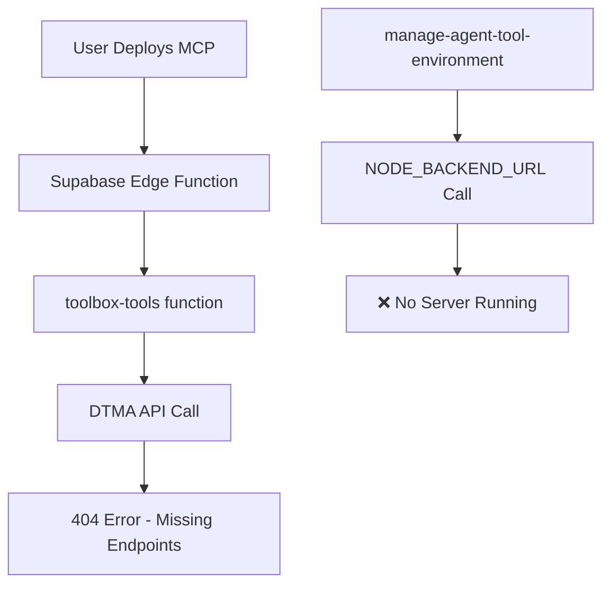
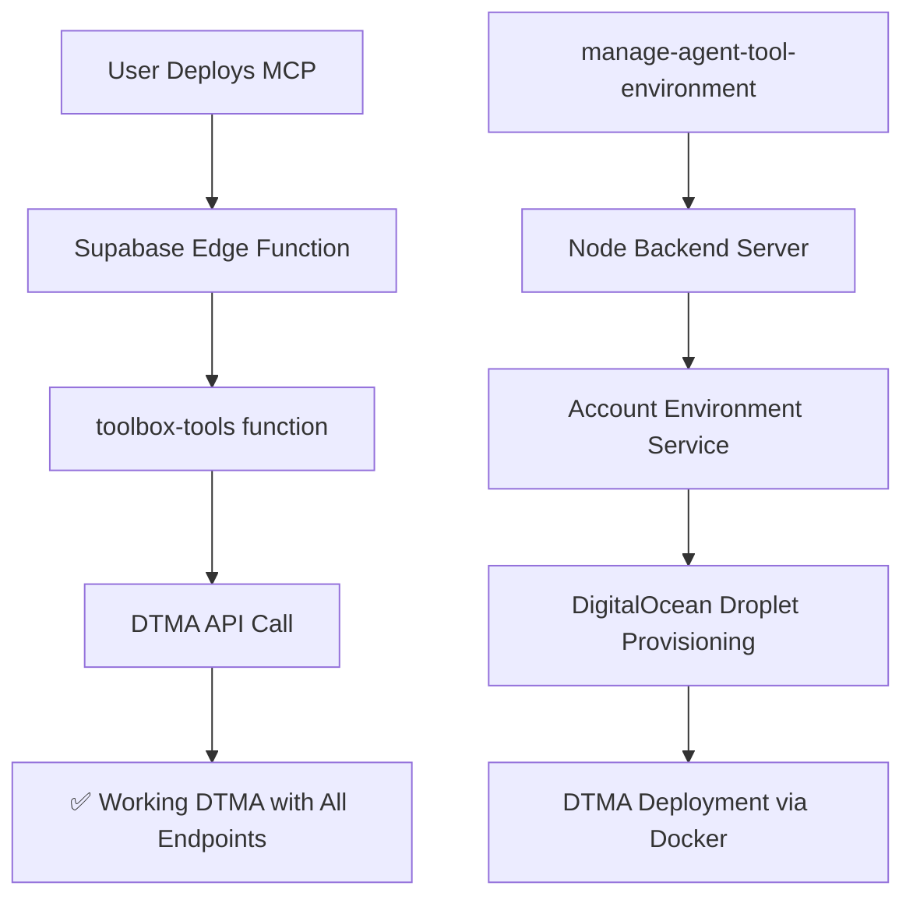
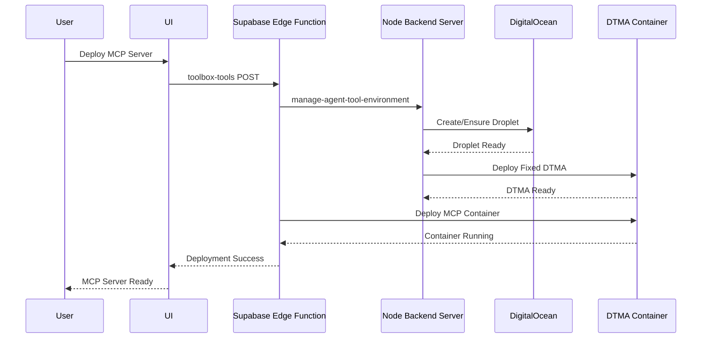

# MCP Deployment Automation Solution

## Root Cause Analysis

The MCP deployment system is **partially automated** but has a critical missing component: the **Node.js backend server** that handles internal API calls for tool environment provisioning.

### Current Architecture (Broken)



### Required Architecture (Working)



## Missing Components

### 1. **Node.js Backend Server** (Critical)
- **Status**: ❌ **MISSING**
- **Expected**: Server running on port 3000 (or `NODE_BACKEND_URL`)
- **Purpose**: Handle `/internal/agents/{agentId}/ensure-tool-environment` calls
- **Location**: Should import `src/services/internal_api/agentEnvironmentEndpoints.ts`

### 2. **Working DTMA Deployment** (In Progress)
- **Status**: ⚠️ **PARTIALLY FIXED**
- **Issue**: Deployed DTMA missing container lifecycle endpoints
- **Solution**: Deploy fixed DTMA image (already built locally)

### 3. **Environment Configuration** (Needs Setup)
- **Status**: ⚠️ **INCOMPLETE**
- **Missing**: `NODE_BACKEND_URL`, `INTERNAL_API_SECRET`, `BACKEND_TO_DTMA_API_KEY`

## Solution Implementation

### Phase 1: Create Missing Node Backend Server

#### Step 1.1: Create Main Server File

```typescript
// server.ts
import express from 'express';
import cors from 'cors';
import { config } from 'dotenv';
import agentEnvironmentRoutes from './src/services/internal_api/agentEnvironmentEndpoints.js';

config();

const app = express();
const PORT = process.env.PORT || 3000;

// Middleware
app.use(cors());
app.use(express.json());

// Health check
app.get('/health', (req, res) => {
  res.json({ 
    status: 'healthy', 
    timestamp: new Date().toISOString(),
    service: 'Agentopia Backend',
    version: '1.0.0'
  });
});

// Internal API routes
app.use('/internal', agentEnvironmentRoutes);

// Error handling
app.use((err: any, req: any, res: any, next: any) => {
  console.error('Error:', err);
  res.status(500).json({ 
    error: 'Internal server error',
    message: err.message 
  });
});

// Start server
const server = app.listen(PORT, () => {
  console.log(`=== Agentopia Backend Server ===`);
  console.log(`Port: ${PORT}`);
  console.log(`Health Check: http://localhost:${PORT}/health`);
  console.log(`Internal API: http://localhost:${PORT}/internal`);
  console.log(`=== Server Ready ===`);
});

// Graceful shutdown
process.on('SIGTERM', () => {
  console.log('SIGTERM received, shutting down gracefully');
  server.close(() => {
    console.log('Server closed');
    process.exit(0);
  });
});

export default app;
```

#### Step 1.2: Update Package.json

```json
{
  "scripts": {
    "dev": "vite",
    "build": "vite build",
    "lint": "eslint .",
    "preview": "vite preview",
    "server": "ts-node server.ts",
    "server:dev": "ts-node --watch server.ts"
  },
  "dependencies": {
    // ... existing dependencies ...
    "express": "^4.19.2",
    "cors": "^2.8.5"
  },
  "devDependencies": {
    // ... existing devDependencies ...
    "@types/express": "^4.17.21",
    "@types/cors": "^2.8.17"
  }
}
```

#### Step 1.3: Fix Import Issues in agentEnvironmentEndpoints.ts

The current file uses Deno-style imports but needs Node.js imports:

```typescript
// src/services/internal_api/agentEnvironmentEndpoints.ts
import express, { Request, Response, NextFunction } from 'express';
import { ensureToolEnvironmentReady, deprovisionAgentDroplet } from '../agent_environment_service/manager.js';

// ... rest of the file remains the same
```

### Phase 2: Environment Configuration

#### Step 2.1: Update Supabase Environment Variables

Add these to your Supabase project environment variables:

```bash
NODE_BACKEND_URL=http://localhost:3000  # Or your deployed backend URL
INTERNAL_API_SECRET=your-secure-random-secret
BACKEND_TO_DTMA_API_KEY=your-dtma-api-key
DTMA_DOCKER_IMAGE_URL=dtma-agent:fixed-20250619  # The fixed image we built
```

#### Step 2.2: Local Development .env

```bash
# Backend Server
PORT=3000
NODE_ENV=development

# Internal API Security
INTERNAL_API_SECRET=your-secure-random-secret-here

# DTMA Configuration
BACKEND_TO_DTMA_API_KEY=your-dtma-api-key-here
DTMA_DOCKER_IMAGE_URL=dtma-agent:fixed-20250619

# DigitalOcean Configuration
DO_API_TOKEN=your-do-token
DO_DEFAULT_REGION=nyc3
DO_DEFAULT_SIZE=s-1vcpu-1gb
DO_DEFAULT_IMAGE=ubuntu-22-04-x64
DO_SSH_KEY_FINGERPRINTS=your-ssh-keys

# Supabase
SUPABASE_URL=your-supabase-url
SUPABASE_SERVICE_ROLE_KEY=your-service-role-key
```

### Phase 3: DTMA Deployment Fix

#### Step 3.1: Deploy Fixed DTMA Image

We already have the fixed DTMA image built locally. We need to:

1. **Push to registry** (if using container registry)
2. **Or deploy directly** to the droplet

#### Step 3.2: Update Environment Variables

Ensure the Supabase environment has:
```bash
DTMA_DOCKER_IMAGE_URL=dtma-agent:fixed-20250619
```

### Phase 4: Automated Deployment Flow

#### Step 4.1: Complete Automation Flow



#### Step 4.2: Zero Manual Intervention

Once implemented, the flow will be:

1. **User clicks "Deploy MCP"** in UI
2. **System automatically**:
   - Provisions DigitalOcean droplet if needed
   - Deploys working DTMA to droplet
   - Deploys MCP container to DTMA
   - Returns success status
3. **No SSH access required**
4. **No manual commands required**

## Implementation Checklist

### Immediate Actions (Fix Current Issue)

- [ ] **Create `server.ts`** with Express server
- [ ] **Update package.json** with server scripts
- [ ] **Fix import paths** in agentEnvironmentEndpoints.ts
- [ ] **Set environment variables** in Supabase
- [ ] **Start Node backend server**
- [ ] **Test automated flow**

### Medium Term (Complete Automation)

- [ ] **Deploy fixed DTMA image** to registry
- [ ] **Update DTMA_DOCKER_IMAGE_URL** in environment
- [ ] **Add monitoring** for backend server health
- [ ] **Add error handling** for failed deployments
- [ ] **Add retry logic** for transient failures

### Long Term (Production Ready)

- [ ] **Containerize Node backend** for deployment
- [ ] **Add load balancing** for high availability
- [ ] **Add comprehensive logging** and monitoring
- [ ] **Add automated testing** for deployment flow
- [ ] **Add rollback capabilities** for failed deployments

## Expected Results

After implementing this solution:

✅ **MCP deployment will be fully automated**
✅ **No SSH access required**
✅ **No manual commands required**
✅ **Zero user intervention needed**
✅ **Droplets auto-provision when needed**
✅ **DTMA auto-deploys with all endpoints**
✅ **MCP containers deploy successfully**
✅ **All 404 errors eliminated**

## Testing the Solution

### Test 1: Backend Server
```bash
npm run server:dev
curl http://localhost:3000/health
```

### Test 2: Internal API
```bash
curl -X POST http://localhost:3000/internal/agents/test-agent/ensure-tool-environment \
  -H "X-Internal-Api-Secret: your-secret" \
  -H "Content-Type: application/json"
```

### Test 3: Full MCP Deployment
1. Start backend server
2. Deploy MCP through UI
3. Verify automatic provisioning
4. Verify MCP container running

## Security Considerations

- **INTERNAL_API_SECRET**: Use strong random secret (32+ characters)
- **BACKEND_TO_DTMA_API_KEY**: Use strong random secret for DTMA auth
- **Environment isolation**: Keep secrets in environment variables only
- **Network security**: Ensure proper firewall rules on droplets
- **Access control**: Verify user ownership before provisioning

## Monitoring and Maintenance

- **Health checks**: Monitor backend server health
- **Log aggregation**: Collect logs from all components
- **Error alerting**: Alert on deployment failures
- **Resource monitoring**: Monitor droplet resources
- **Cost tracking**: Monitor DigitalOcean costs

This solution provides **complete automation** while maintaining security and reliability. 