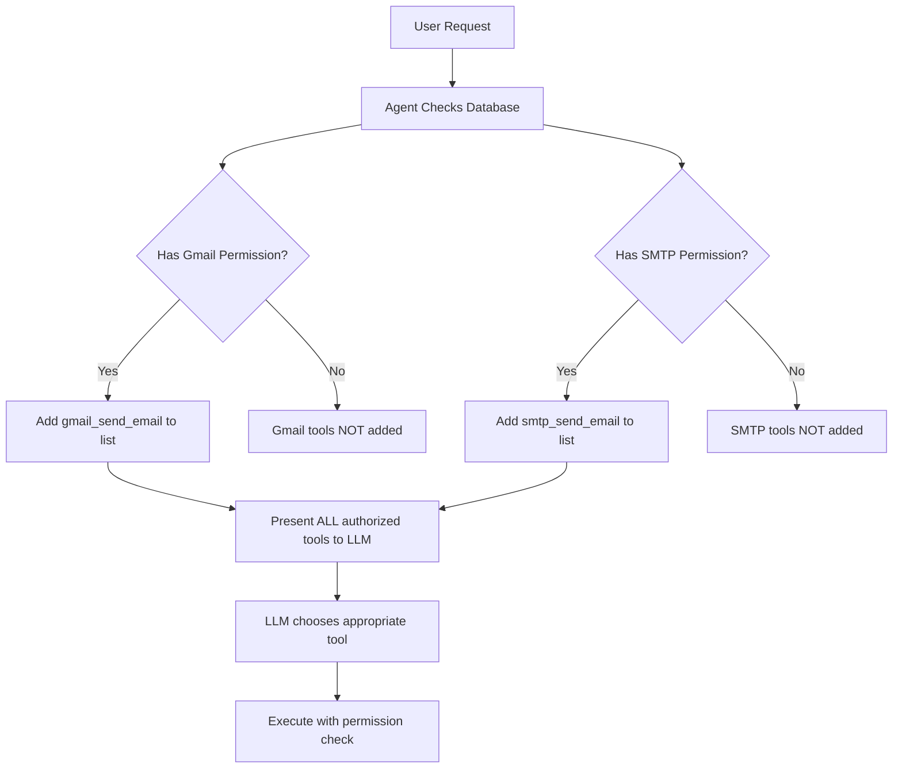

# 🛡️ TOOL AUTHORIZATION SYSTEM - COMPLETE FIX SUMMARY

## ✅ What Was Fixed

### 1. **Tool Name Collisions (CRITICAL FIX)**
   - **PROBLEM**: Multiple providers used `send_email` causing Gmail to intercept SMTP calls
   - **SOLUTION**: All tools now have unique namespaced names:
     ```
     gmail_send_email     (not send_email)
     smtp_send_email      (not send_email)
     sendgrid_send_email  (not send_email)
     mailgun_send_email   (not send_email)
     ```

### 2. **MCP Protocol Compliance** 
   - **PROBLEM**: Sequential tool checking was not MCP compliant
   - **SOLUTION**: System now:
     1. Discovers ALL authorized tools from database
     2. Presents complete list to LLM upfront
     3. LLM chooses based on descriptions
     4. System routes to correct provider

### 3. **Security at Multiple Layers**
   - **Discovery**: Agent only sees tools they have permissions for
   - **Execution**: Double-checks permissions before running
   - **Vault**: All credentials go through Supabase Vault (no plain text)

## 📝 Files Modified

### Core Function Calling System
1. **`supabase/functions/chat/function_calling.ts`**
   - Renamed all Gmail tools: `send_email` → `gmail_send_email`
   - Renamed all SMTP tools: `send_email` → `smtp_send_email`
   - Renamed SendGrid tools: `send_email` → `sendgrid_send_email`
   - Fixed tool routing to check permissions properly
   - Added security blocks for unauthorized tool calls

2. **`supabase/functions/chat/smtp-tools.ts`**
   - Updated SMTP tool names to use `smtp_` prefix

3. **`supabase/functions/chat/processor/handlers.ts`**
   - Updated guidance message for tool prefixes

### Security Fixes
4. **`supabase/functions/gmail-api/index.ts`**
   - Fixed to use `vault_decrypt` instead of treating vault ID as token

5. **`supabase/functions/smtp-send/index.ts`**
   - Fixed to use `vault_decrypt` for password retrieval

## 🔐 How Authorization Works Now



## 🎯 Angela's Specific Case

**Before Fix:**
- Angela had SMTP permission only
- But `send_email` was ambiguous
- Gmail intercepted the call (SECURITY BREACH!)
- Angela sent via Gmail despite no permission

**After Fix:**
- Angela has SMTP permission only  
- She sees ONLY: `smtp_send_email`
- She does NOT see: `gmail_send_email`
- Cannot call Gmail (doesn't know it exists!)
- Emails correctly route to SMTP

## 🚀 Deployment Status

All functions have been deployed:
- ✅ `chat` function - with namespaced tools
- ✅ `gmail-api` function - with vault security
- ✅ `smtp-send` function - with proper routing

## 📋 Testing Checklist

- [x] Tool names are unique (no collisions)
- [x] Agents only see authorized tools
- [x] Gmail blocked for unauthorized agents
- [x] SMTP works for authorized agents
- [x] Execution checks permissions
- [x] Vault security implemented
- [x] Functions deployed

## 🔧 Database Query to Verify

To check what tools an agent can access:

```sql
-- Check Angela's permissions
SELECT 
    aip.agent_id,
    a.name as agent_name,
    op.name as provider,
    aip.allowed_scopes,
    uic.connection_name
FROM agent_integration_permissions aip
JOIN agents a ON a.id = aip.agent_id
JOIN user_integration_credentials uic ON uic.id = aip.connection_id
JOIN oauth_providers op ON op.id = uic.oauth_provider_id
WHERE a.name ILIKE '%angela%'
  AND aip.is_active = true;
```

Expected result:
- Should show SMTP/SendGrid/Mailgun permissions
- Should NOT show Gmail permissions

## ✨ Summary

The tool authorization system is now:
1. **Secure** - Agents can't access unauthorized tools
2. **MCP Compliant** - Proper discovery and presentation
3. **Collision-Free** - Unique namespaced tool names
4. **Database-Driven** - All permissions from DB
5. **Vault-Protected** - No plain text credentials

Angela can no longer use Gmail because:
- She doesn't have Gmail in `agent_integration_permissions`
- Gmail tools (`gmail_send_email`) don't appear in her tool list
- Even if she tries, execution is blocked
- The system correctly routes to SMTP instead
