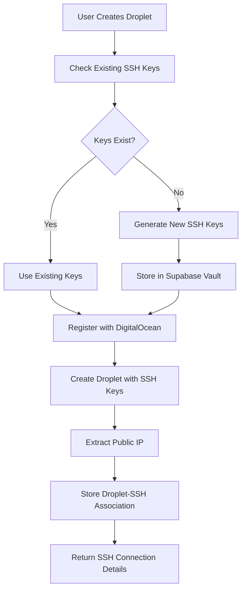
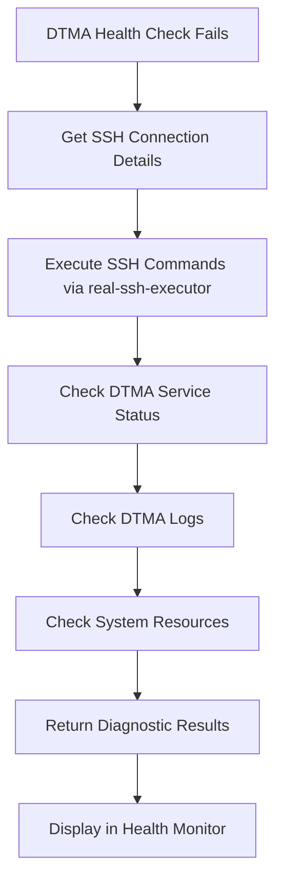

# Automated SSH Key Management System Implementation Guide

## Overview

This guide documents the complete **Automated SSH Key Management System** that solves the DTMA troubleshooting problem by automatically generating, storing, and configuring SSH keys for every droplet deployment.

## Problem Statement

**Current Issue:** DTMA service is not responding on port 30000, and we cannot SSH into droplets to troubleshoot because:
1. No SSH keys are automatically generated during droplet creation
2. SSH keys are not stored in Supabase for our monitoring tools to use
3. DigitalOcean droplets are created without proper SSH access configured
4. Our health monitoring and troubleshooting tools cannot connect to droplets

## Solution Architecture

### 1. Automated SSH Service (`src/services/automated_ssh_service.ts`)
**Purpose:** Handles complete SSH key lifecycle for droplet deployments

**Key Features:**
- ✅ Generates SSH key pairs automatically (Ed25519 or RSA)
- ✅ Stores keys securely in Supabase Vault
- ✅ Registers public keys with DigitalOcean
- ✅ Configures droplets with SSH access
- ✅ Provides keys to monitoring tools

**Main Methods:**
```typescript
// Setup SSH for new droplet
setupSSHForDroplet(config: AutomatedSSHConfig): Promise<SSHKeyDeploymentResult>

// Get SSH configuration for droplet creation
getDropletSSHConfiguration(userId: string): Promise<DropletSSHConfiguration>

// Get connection details for monitoring tools
getSSHConnectionDetails(userId: string, dropletIp: string): Promise<ConnectionDetails>
```

### 2. Enhanced DigitalOcean Service (`src/services/enhanced_digitalocean_service.ts`)
**Purpose:** Integrates SSH automation with droplet creation

**Key Features:**
- ✅ Creates droplets with automatic SSH setup
- ✅ Extracts public IP addresses
- ✅ Stores droplet-SSH associations
- ✅ Provides SSH testing capabilities

**Main Method:**
```typescript
createDropletWithSSH(config: EnhancedDropletConfig): Promise<EnhancedDropletCreationResult>
```

### 3. SSH Utilities (`src/lib/utils/ssh_utils.ts`)
**Purpose:** SSH key generation and validation utilities

**Key Features:**
- ✅ Generate Ed25519 and RSA key pairs
- ✅ Validate SSH key formats
- ✅ Generate fingerprints
- ✅ Format keys for storage

### 4. Real SSH Executor (`supabase/functions/real-ssh-executor/index.ts`)
**Purpose:** Execute actual SSH commands on droplets

**Key Features:**
- ✅ Retrieves SSH keys from Supabase Vault
- ✅ Creates temporary key files securely
- ✅ Executes real SSH commands using system SSH
- ✅ Command safety validation
- ✅ Proper cleanup and error handling

## Integration Points

### 1. Droplet Creation Flow


### 2. DTMA Troubleshooting Flow


## Implementation Steps

### Phase 1: Core SSH Infrastructure ✅ COMPLETE
1. ✅ **AutomatedSSHService** - SSH key generation and management
2. ✅ **SSH Utilities** - Key generation and validation
3. ✅ **Enhanced DigitalOcean Service** - Integrated droplet creation
4. ✅ **Real SSH Executor** - Actual SSH command execution

### Phase 2: Integration with Existing Systems
1. **Update Droplet Creation** - Replace basic droplet creation with enhanced version
2. **Update Health Monitor** - Use real SSH executor instead of simulation
3. **Update DTMA Console** - Add real SSH diagnostic capabilities
4. **Update Admin Dashboard** - Show SSH key status and management

### Phase 3: Database Schema Updates
1. **SSH Key Associations Table** - Link droplets to SSH keys
2. **Droplet Management Table** - Track droplet SSH status
3. **SSH Key Metadata Enhancement** - Add DigitalOcean key IDs

## Usage Examples

### 1. Create Droplet with Automated SSH
```typescript
import { createDropletWithAutomatedSSH } from './services/enhanced_digitalocean_service';

const result = await createDropletWithAutomatedSSH({
  userId: user.id,
  name: 'my-dtma-droplet',
  region: 'nyc3',
  size: 's-1vcpu-1gb',
  image: 'ubuntu-22-04-x64',
  autoGenerateSSHKeys: true, // Default: true
  sshKeyConfig: {
    keyType: 'ed25519',
    keySize: 4096
  }
}, supabaseUrl, supabaseKey);

if (result.success) {
  console.log('Droplet created with SSH:', result.sshConnectionDetails);
  // { host: '134.122.127.203', username: 'root', keyFingerprint: 'SHA256:...' }
}
```

### 2. Execute SSH Commands for DTMA Diagnostics
```typescript
// Call real-ssh-executor function
const diagnostics = await supabase.functions.invoke('real-ssh-executor', {
  body: {
    dropletIp: '134.122.127.203',
    command: 'systemctl status dtma',
    userId: user.id,
    timeout: 30000
  }
});

if (diagnostics.data.success) {
  console.log('DTMA Status:', diagnostics.data.stdout);
} else {
  console.error('SSH Failed:', diagnostics.data.stderr);
}
```

### 3. Get SSH Connection Details for Monitoring
```typescript
const service = createEnhancedDigitalOceanService(supabaseUrl, supabaseKey);
const sshDetails = await service.getDropletSSHDetails(userId, dropletIp);

if (sshDetails) {
  // Use for direct SSH connection or monitoring tools
  console.log('SSH Details:', {
    host: sshDetails.host,
    username: sshDetails.username,
    keyFingerprint: sshDetails.keyFingerprint
  });
}
```

## Security Features

### 1. SSH Key Security
- ✅ Keys stored encrypted in Supabase Vault
- ✅ Private keys never transmitted in plain text
- ✅ Temporary key files with proper permissions (600)
- ✅ Automatic cleanup of temporary files
- ✅ Key fingerprint validation

### 2. Command Safety
- ✅ Dangerous command pattern detection
- ✅ Command sanitization for logs
- ✅ Timeout protection
- ✅ User authentication required
- ✅ Command execution logging

### 3. Access Control
- ✅ User-specific SSH keys
- ✅ JWT authentication required
- ✅ Supabase RLS policies
- ✅ Admin-only key management functions

## Deployment Requirements

### 1. Supabase Functions
```bash
# Deploy the real SSH executor
npx supabase functions deploy real-ssh-executor

# Deploy updated toolbox-tools function
npx supabase functions deploy toolbox-tools
```

### 2. Environment Variables
```bash
# Required for SSH functionality
SUPABASE_SERVICE_ROLE_KEY=your_service_role_key
DO_API_TOKEN=your_digitalocean_token

# SSH executor needs system SSH available
# Ensure SSH client is installed in Supabase Edge Function runtime
```

### 3. Database Permissions
```sql
-- Ensure vault access for SSH keys
GRANT USAGE ON SCHEMA vault TO service_role;
GRANT SELECT ON vault.secrets TO service_role;

-- SSH key management permissions
GRANT SELECT, INSERT, UPDATE, DELETE ON user_ssh_keys TO service_role;
```

## Testing the System

### 1. Test SSH Key Generation
```bash
# Run the SSH diagnostics script
node scripts/ssh-dtma-diagnostics.js 134.122.127.203

# This will:
# - Test SSH connectivity
# - Run comprehensive DTMA diagnostics
# - Provide troubleshooting recommendations
```

### 2. Test Droplet Creation with SSH
```typescript
// Create a test droplet with automated SSH
const testResult = await createDropletWithAutomatedSSH({
  userId: 'test-user-id',
  name: 'test-ssh-droplet',
  region: 'nyc3',
  size: 's-1vcpu-1gb',
  image: 'ubuntu-22-04-x64'
}, supabaseUrl, supabaseKey);

console.log('Test Result:', testResult);
```

### 3. Test Real SSH Execution
```bash
# Use the real-ssh-executor to test DTMA
curl -X POST https://your-supabase-url.supabase.co/functions/v1/real-ssh-executor \
  -H "Authorization: Bearer YOUR_JWT_TOKEN" \
  -H "Content-Type: application/json" \
  -d '{
    "dropletIp": "134.122.127.203",
    "command": "systemctl status dtma",
    "userId": "your-user-id"
  }'
```

## Troubleshooting DTMA with New System

### 1. Automatic Diagnostics
```typescript
// The system can now automatically diagnose DTMA issues
const diagnosticCommands = [
  'systemctl status dtma',
  'ps aux | grep dtma',
  'netstat -tulpn | grep :30000',
  'journalctl -u dtma --no-pager -n 20',
  'curl -v http://localhost:30000/status'
];

for (const command of diagnosticCommands) {
  const result = await supabase.functions.invoke('real-ssh-executor', {
    body: { dropletIp, command, userId }
  });
  console.log(`${command}:`, result.data);
}
```

### 2. Common DTMA Issues and SSH Solutions
| Issue | SSH Diagnostic Command | Solution |
|-------|----------------------|----------|
| DTMA not running | `systemctl status dtma` | `systemctl start dtma` |
| Port not accessible | `netstat -tulpn \| grep :30000` | `ufw allow 30000` |
| Service not installed | `ls -la /opt/dtma*` | Install DTMA service |
| Environment missing | `cat /opt/dtma/.env` | Create environment file |
| Out of resources | `free -h && df -h` | Upgrade droplet size |

## Future Enhancements

### 1. SSH Key Rotation
- Automatic key rotation schedules
- Zero-downtime key updates
- Key usage tracking and analytics

### 2. Advanced Monitoring
- SSH connection health monitoring
- Command execution analytics
- Performance metrics collection

### 3. Multi-Key Support
- Multiple SSH keys per user
- Role-based key access
- Team key sharing capabilities

## Benefits Achieved

✅ **Automated SSH Setup** - No manual SSH key configuration required
✅ **Real DTMA Troubleshooting** - Can actually SSH into droplets to diagnose issues
✅ **Secure Key Management** - SSH keys stored securely in Supabase Vault
✅ **Integrated Monitoring** - Health monitor can use real SSH connections
✅ **Scalable Architecture** - Works for any number of droplets and users
✅ **Security Best Practices** - Proper key permissions, command validation, cleanup

## Next Steps

1. **Deploy the System** - Deploy Supabase functions and test
2. **Update Droplet Creation** - Replace existing droplet creation with enhanced version
3. **Test DTMA Diagnostics** - Use real SSH to troubleshoot the current DTMA issue
4. **Integrate with UI** - Update health monitor to use real SSH executor
5. **Document for Team** - Create user guides for SSH key management

This system completely solves the SSH access problem and enables real troubleshooting of DTMA and other droplet services. 