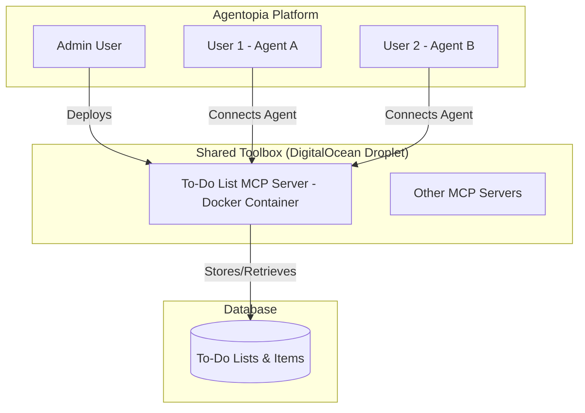

# Chat Mode vs Agent Mode - MCP Server Approach

**Date:** October 10, 2025  
**Revised Approach:** Leverage Existing MCP Server Deployment Infrastructure  
**Status:** Ready for Implementation

---

## 🎯 Executive Summary

This revised approach leverages Agentopia's **complete MCP server deployment infrastructure** to create a **To-Do List MCP Server** that can be:

1. **Deployed by admins** to shared toolboxes via DTMA
2. **Connected to agents** that are in "Agent Mode"
3. **Used autonomously** by agents to plan and track work
4. **Monitored and managed** through existing MCP infrastructure

This is the **correct architectural approach** as it:
- Uses the proven MCP server deployment system
- Follows the "Magic Toolbox" model (servers in drawers)
- Enables true separation between admin deployment and user connection
- Scales across multiple agents and toolboxes

---

## 🏗️ Architecture Overview

### The MCP Magic Toolbox Model



### Flow: Admin Deploys → Users Connect → Agents Use

```
┌─────────────────────────────────────────────────────────────┐
│ PHASE 1: Admin Deployment (One-Time Setup)                  │
├─────────────────────────────────────────────────────────────┤
│ 1. Admin goes to MCP Marketplace                            │
│ 2. Selects "To-Do List MCP Server" template                │
│ 3. Clicks "Deploy to Toolbox"                              │
│ 4. AdminMCPService.deployMCPServer()                       │
│ 5. DTMA deploys Docker container to DigitalOcean          │
│ 6. Server registered in account_tool_instances            │
│ 7. Status: "running" - Ready for connections              │
└─────────────────────────────────────────────────────────────┘
                            ↓
┌─────────────────────────────────────────────────────────────┐
│ PHASE 2: User Connection (Per Agent)                        │
├─────────────────────────────────────────────────────────────┤
│ 1. User configures agent in "Agent Mode"                   │
│ 2. Goes to Agent Settings → MCP tab                        │
│ 3. Sees "To-Do List Server" in available servers          │
│ 4. Clicks "Connect"                                        │
│ 5. UserMCPService.connectAgentToMCPServer()               │
│ 6. Connection record created in agent_mcp_connections     │
│ 7. Tools auto-discovered and available to agent           │
└─────────────────────────────────────────────────────────────┘
                            ↓
┌─────────────────────────────────────────────────────────────┐
│ PHASE 3: Agent Autonomous Usage                             │
├─────────────────────────────────────────────────────────────┤
│ 1. User: "Update all customer contacts from the CSV"       │
│ 2. Agent (in Agent Mode) recognizes complex task          │
│ 3. Calls plan_tasks tool → Creates to-do list             │
│ 4. Executes tasks autonomously                             │
│ 5. Updates status with update_task after each step        │
│ 6. Calls close_list when complete                         │
│ 7. Reports completion to user                              │
└─────────────────────────────────────────────────────────────┘
```

---

## 📦 Component 1: To-Do List MCP Server

### Overview
A standalone MCP server (Docker container) that implements the Model Context Protocol and provides to-do list management tools.

### Technology Stack
- **Runtime:** Node.js 20+ or Deno
- **Protocol:** MCP (Model Context Protocol)
- **Transport:** HTTP+SSE (for network communication)
- **Database Client:** Supabase JS Client
- **Container:** Docker with proper health checks

### MCP Server Structure

```
todo-list-mcp-server/
├── Dockerfile
├── package.json
├── src/
│   ├── index.ts              # MCP server entry point
│   ├── tools/
│   │   ├── plan_tasks.ts     # Create new to-do list
│   │   ├── create_task.ts    # Add task to list
│   │   ├── update_task.ts    # Update task status
│   │   ├── get_todo_list.ts  # Retrieve list and tasks
│   │   └── close_list.ts     # Complete/cancel list
│   ├── database/
│   │   ├── client.ts         # Supabase client setup
│   │   └── queries.ts        # Database queries
│   ├── types/
│   │   └── index.ts          # TypeScript types
│   └── server.ts             # MCP protocol implementation
├── .env.example
└── README.md
```

### MCP Server Implementation

**src/index.ts** - Main Entry Point
```typescript
import { MCPServer } from '@modelcontextprotocol/sdk/server';
import { createSupabaseClient } from './database/client';
import { registerTools } from './tools';

const server = new MCPServer({
  name: 'todo-list-server',
  version: '1.0.0',
  capabilities: {
    tools: true,
    resources: false,
    prompts: false
  }
});

// Initialize Supabase client
const supabase = createSupabaseClient({
  url: process.env.SUPABASE_URL!,
  serviceRoleKey: process.env.SUPABASE_SERVICE_ROLE_KEY!
});

// Register all tools
registerTools(server, supabase);

// Start server
server.listen({
  transport: 'http',
  port: parseInt(process.env.PORT || '8080'),
  host: '0.0.0.0'
});

console.log('To-Do List MCP Server running on port 8080');
```

**src/tools/plan_tasks.ts** - Plan Tasks Tool
```typescript
import { Tool } from '@modelcontextprotocol/sdk/types';
import { SupabaseClient } from '@supabase/supabase-js';

export const planTasksTool: Tool = {
  name: 'plan_tasks',
  description: 'Create a new to-do list for accomplishing a specific goal',
  inputSchema: {
    type: 'object',
    properties: {
      agent_id: {
        type: 'string',
        description: 'UUID of the agent creating the list'
      },
      user_id: {
        type: 'string',
        description: 'UUID of the user who owns the agent'
      },
      conversation_id: {
        type: 'string',
        description: 'Optional conversation ID to associate the list with'
      },
      goal: {
        type: 'string',
        description: 'The overall goal or objective to accomplish'
      },
      title: {
        type: 'string',
        description: 'Optional custom title for the to-do list'
      },
      initial_tasks: {
        type: 'array',
        description: 'Optional array of initial tasks',
        items: {
          type: 'object',
          properties: {
            title: { type: 'string' },
            description: { type: 'string' },
            order_index: { type: 'number' }
          },
          required: ['title', 'order_index']
        }
      }
    },
    required: ['agent_id', 'user_id', 'goal']
  }
};

export async function handlePlanTasks(
  supabase: SupabaseClient,
  params: any
): Promise<any> {
  const { agent_id, user_id, conversation_id, goal, title, initial_tasks } = params;
  
  // Create the to-do list
  const { data: list, error: listError } = await supabase
    .from('agent_todo_lists')
    .insert({
      agent_id,
      user_id,
      conversation_id,
      title: title || `Plan: ${goal.substring(0, 50)}`,
      goal,
      status: 'active'
    })
    .select()
    .single();

  if (listError) {
    throw new Error(`Failed to create list: ${listError.message}`);
  }

  // Create initial tasks if provided
  let tasks = [];
  if (initial_tasks && initial_tasks.length > 0) {
    const { data: createdTasks, error: tasksError } = await supabase
      .from('agent_todo_items')
      .insert(
        initial_tasks.map((task: any) => ({
          list_id: list.id,
          title: task.title,
          description: task.description,
          order_index: task.order_index,
          status: 'pending'
        }))
      )
      .select();

    if (tasksError) {
      console.error('Failed to create initial tasks:', tasksError);
    } else {
      tasks = createdTasks || [];
    }
  }

  return {
    success: true,
    data: {
      list_id: list.id,
      title: list.title,
      goal: list.goal,
      tasks_created: tasks.length,
      tasks
    }
  };
}
```

**src/tools/update_task.ts** - Update Task Tool
```typescript
export const updateTaskTool: Tool = {
  name: 'update_task',
  description: 'Update the status or details of a task',
  inputSchema: {
    type: 'object',
    properties: {
      item_id: {
        type: 'string',
        description: 'UUID of the task to update'
      },
      status: {
        type: 'string',
        enum: ['pending', 'in_progress', 'completed', 'blocked', 'cancelled'],
        description: 'New status for the task'
      },
      title: {
        type: 'string',
        description: 'Updated task title'
      },
      execution_result: {
        type: 'object',
        description: 'Result data from task execution'
      },
      blocking_reason: {
        type: 'string',
        description: 'Reason why task is blocked (if status is blocked)'
      }
    },
    required: ['item_id']
  }
};

export async function handleUpdateTask(
  supabase: SupabaseClient,
  params: any
): Promise<any> {
  const { item_id, status, title, execution_result, blocking_reason } = params;
  
  const updateData: any = {
    updated_at: new Date().toISOString()
  };

  if (status) {
    updateData.status = status;
    if (status === 'in_progress' && !params.started_at) {
      updateData.started_at = new Date().toISOString();
    }
    if (status === 'completed') {
      updateData.completed_at = new Date().toISOString();
    }
  }

  if (title) updateData.title = title;
  if (execution_result) updateData.execution_result = execution_result;
  if (blocking_reason) updateData.blocking_reason = blocking_reason;

  const { data, error } = await supabase
    .from('agent_todo_items')
    .update(updateData)
    .eq('id', item_id)
    .select()
    .single();

  if (error) {
    throw new Error(`Failed to update task: ${error.message}`);
  }

  return {
    success: true,
    data: {
      item_id: data.id,
      status: data.status,
      updated_fields: Object.keys(updateData)
    }
  };
}
```

**Dockerfile**
```dockerfile
FROM node:20-alpine

WORKDIR /app

# Copy package files
COPY package*.json ./

# Install dependencies
RUN npm ci --only=production

# Copy source code
COPY src/ ./src/

# Health check
HEALTHCHECK --interval=30s --timeout=3s --start-period=5s --retries=3 \
  CMD node -e "require('http').get('http://localhost:8080/health', (r) => process.exit(r.statusCode === 200 ? 0 : 1))"

# Expose MCP server port
EXPOSE 8080

# Run the server
CMD ["node", "src/index.js"]
```

---

## 📊 Component 2: Database Schema

### Tables Required

```sql
-- Agent to-do lists (collections of tasks for a specific goal/session)
CREATE TABLE agent_todo_lists (
    id UUID PRIMARY KEY DEFAULT gen_random_uuid(),
    agent_id UUID NOT NULL REFERENCES agents(id) ON DELETE CASCADE,
    user_id UUID NOT NULL REFERENCES auth.users(id) ON DELETE CASCADE,
    conversation_id UUID REFERENCES chat_conversations(id) ON DELETE CASCADE,
    
    -- List metadata
    title TEXT NOT NULL,
    description TEXT,
    goal TEXT NOT NULL,
    
    -- Status tracking
    status TEXT NOT NULL DEFAULT 'active',
    priority TEXT DEFAULT 'medium',
    
    -- Timestamps
    created_at TIMESTAMPTZ DEFAULT NOW(),
    updated_at TIMESTAMPTZ DEFAULT NOW(),
    completed_at TIMESTAMPTZ,
    
    -- Indexes
    CONSTRAINT agent_todo_lists_status_check CHECK (status IN ('active', 'completed', 'cancelled'))
);

-- Individual to-do items within a list
CREATE TABLE agent_todo_items (
    id UUID PRIMARY KEY DEFAULT gen_random_uuid(),
    list_id UUID NOT NULL REFERENCES agent_todo_lists(id) ON DELETE CASCADE,
    
    -- Item details
    title TEXT NOT NULL,
    description TEXT,
    task_type TEXT DEFAULT 'action',
    
    -- Order and hierarchy
    order_index INTEGER NOT NULL DEFAULT 0,
    parent_item_id UUID REFERENCES agent_todo_items(id) ON DELETE SET NULL,
    
    -- Status tracking
    status TEXT NOT NULL DEFAULT 'pending',
    blocking_reason TEXT,
    
    -- Execution tracking
    assigned_tool TEXT,
    execution_result JSONB,
    retry_count INTEGER DEFAULT 0,
    max_retries INTEGER DEFAULT 3,
    
    -- Timestamps
    created_at TIMESTAMPTZ DEFAULT NOW(),
    updated_at TIMESTAMPTZ DEFAULT NOW(),
    started_at TIMESTAMPTZ,
    completed_at TIMESTAMPTZ,
    
    CONSTRAINT agent_todo_items_status_check CHECK (status IN ('pending', 'in_progress', 'completed', 'blocked', 'cancelled')),
    CONSTRAINT agent_todo_items_task_type_check CHECK (task_type IN ('action', 'decision', 'question'))
);

-- Indexes for performance
CREATE INDEX idx_agent_todo_lists_agent_id ON agent_todo_lists(agent_id);
CREATE INDEX idx_agent_todo_lists_status ON agent_todo_lists(status);
CREATE INDEX idx_agent_todo_lists_conversation ON agent_todo_lists(conversation_id);
CREATE INDEX idx_agent_todo_items_list_id ON agent_todo_items(list_id);
CREATE INDEX idx_agent_todo_items_status ON agent_todo_items(status);

-- RLS Policies
ALTER TABLE agent_todo_lists ENABLE ROW LEVEL SECURITY;
ALTER TABLE agent_todo_items ENABLE ROW LEVEL SECURITY;

-- Service role has full access (for MCP server)
CREATE POLICY "Service role has full access to todo lists"
  ON agent_todo_lists FOR ALL
  USING (true)
  WITH CHECK (true);

CREATE POLICY "Service role has full access to todo items"
  ON agent_todo_items FOR ALL
  USING (true)
  WITH CHECK (true);

-- Users can view their own todo lists
CREATE POLICY "Users can view their own todo lists"
  ON agent_todo_lists FOR SELECT
  USING (auth.uid() = user_id);

-- Users can view items from their lists
CREATE POLICY "Users can view their todo items"
  ON agent_todo_items FOR SELECT
  USING (
    EXISTS (
      SELECT 1 FROM agent_todo_lists
      WHERE id = agent_todo_items.list_id
      AND user_id = auth.uid()
    )
  );
```

---

## 🎛️ Component 3: Mode Configuration

### Agent Metadata Structure

```typescript
interface AgentModeConfig {
  mode: 'chat' | 'agent';
  auto_create_todos: boolean;
  todo_mcp_server_id?: string;  // ID of connected to-do list MCP server
  require_approval: boolean;
  max_autonomous_actions: number;
}

// Stored in agents.metadata.mode_config
```

### Mode-Specific System Prompts

**Agent Mode Prompt Enhancement:**
```typescript
if (mode === 'agent') {
  sections.push(`=== AGENT MODE INSTRUCTIONS ===
You are operating in AGENT MODE. You work autonomously toward goals.

**To-Do List Management:**
You have access to a To-Do List MCP Server with these tools:
- plan_tasks: Create a new to-do list for complex requests
- create_task: Add additional tasks to the list
- update_task: Mark tasks as in_progress, completed, or blocked
- get_todo_list: Check current list status
- close_list: Mark list as completed when done

**Workflow for Complex Requests:**
1. Analyze the request and determine if it needs a to-do list
2. Call plan_tasks with the goal and initial task breakdown
3. Execute tasks sequentially:
   - Call update_task to mark task as "in_progress"
   - Use appropriate tools to complete the task
   - Call update_task to mark as "completed" with results
4. If blocked, call update_task with status "blocked" and reason
5. When all tasks are done, call close_list with a summary

**Example:**
User: "Update all contacts from the CSV and send confirmation emails"
1. plan_tasks(goal="Update contacts and send emails", initial_tasks=[...])
2. Execute: Parse CSV, validate data, update contacts, send emails
3. Update status after each step
4. close_list(status="completed", summary="Updated 50 contacts, sent 50 emails")

=== END AGENT MODE INSTRUCTIONS ===`);
}
```

---

## 🚀 Deployment Process

### Step 1: Build Docker Image

```bash
# Build the MCP server image
cd services/todo-list-mcp-server
docker build -t todo-list-mcp-server:1.0.0 .

# Push to container registry
docker tag todo-list-mcp-server:1.0.0 registry.digitalocean.com/agentopia/todo-list-mcp-server:1.0.0
docker push registry.digitalocean.com/agentopia/todo-list-mcp-server:1.0.0
```

### Step 2: Add to MCP Marketplace

Create marketplace entry in database:

```sql
INSERT INTO mcp_server_templates (
  id,
  name,
  display_name,
  description,
  category,
  docker_image,
  default_config,
  is_official
) VALUES (
  gen_random_uuid(),
  'todo-list-server',
  'To-Do List Manager',
  'MCP server providing to-do list management for Agent Mode. Enables agents to plan, track, and execute complex multi-step tasks autonomously.',
  'productivity',
  'registry.digitalocean.com/agentopia/todo-list-mcp-server:1.0.0',
  jsonb_build_object(
    'port', 8080,
    'transport', 'http',
    'capabilities', array['tools'],
    'environment_variables', jsonb_build_object(
      'SUPABASE_URL', '${SUPABASE_URL}',
      'SUPABASE_SERVICE_ROLE_KEY', '${SUPABASE_SERVICE_ROLE_KEY}'
    )
  ),
  true
);
```

### Step 3: Admin Deploys Server

**Admin UI Flow:**
1. Admin goes to **MCP Marketplace** page
2. Finds "To-Do List Manager" server
3. Clicks "Deploy to Toolbox"
4. Selects target toolbox (or creates new one)
5. Confirms deployment

**Backend Process:**
```typescript
// AdminMCPService.deployMCPServer() handles:
1. Validates admin permissions
2. Calls DTMA API to deploy Docker container
3. Creates record in account_tool_instances
4. Sets mcp_server_type = 'todo-list'
5. Server becomes available for user connections
```

### Step 4: User Connects Agent

**User UI Flow:**
1. User edits agent settings
2. Goes to **Behavior** tab → Set mode to "Agent Mode"
3. Goes to **MCP** tab
4. Sees "To-Do List Manager" in available servers
5. Clicks "Connect"
6. Tools automatically discovered

**Backend Process:**
```typescript
// UserMCPService.connectAgentToMCPServer() handles:
1. Validates user owns the agent
2. Tests MCP server connection
3. Creates agent_mcp_connections record
4. Tool discovery happens automatically via get-agent-tools
5. Agent can now use to-do list tools
```

---

## 💬 Component 4: UI Enhancements

### Mode Selector in Agent Settings

**Location:** `src/components/modals/agent-settings/BehaviorTab.tsx`

```tsx
<div className="space-y-4">
  <Label>Interaction Mode</Label>
  
  <RadioGroup value={mode} onValueChange={setMode}>
    <div className="grid grid-cols-2 gap-4">
      <Card className={mode === 'chat' ? 'ring-2 ring-primary' : ''}>
        <RadioGroupItem value="chat" id="chat" className="sr-only" />
        <Label htmlFor="chat" className="cursor-pointer">
          <CardHeader>
            <MessageSquare className="w-8 h-8 mb-2" />
            <CardTitle>Chat Mode</CardTitle>
          </CardHeader>
          <CardContent>
            <p className="text-sm text-muted-foreground">
              Conversational responses with approval required for actions
            </p>
          </CardContent>
        </Label>
      </Card>
      
      <Card className={mode === 'agent' ? 'ring-2 ring-primary' : ''}>
        <RadioGroupItem value="agent" id="agent" className="sr-only" />
        <Label htmlFor="agent" className="cursor-pointer">
          <CardHeader>
            <Bot className="w-8 h-8 mb-2" />
            <CardTitle>Agent Mode</CardTitle>
          </CardHeader>
          <CardContent>
            <p className="text-sm text-muted-foreground">
              Autonomous execution with to-do list management
            </p>
          </CardContent>
        </Label>
      </Card>
    </div>
  </RadioGroup>
  
  {mode === 'agent' && (
    <Alert>
      <AlertCircle className="h-4 w-4" />
      <AlertTitle>Agent Mode Requirements</AlertTitle>
      <AlertDescription>
        Connect to a To-Do List MCP Server in the MCP tab to enable full Agent Mode capabilities.
      </AlertDescription>
    </Alert>
  )}
</div>
```

### To-Do List Sidebar

**Location:** `src/components/chat/TodoListSidebar.tsx`

```tsx
export function TodoListSidebar({ agentId, conversationId }: Props) {
  const [todoList, setTodoList] = useState<TodoList | null>(null);
  const [items, setItems] = useState<TodoItem[]>([]);
  
  // Real-time subscription to to-do list updates
  useEffect(() => {
    const subscription = supabase
      .channel(`todo-list-${conversationId}`)
      .on('postgres_changes', {
        event: '*',
        schema: 'public',
        table: 'agent_todo_items',
        filter: `list_id=eq.${todoList?.id}`
      }, (payload) => {
        // Update items in real-time
        handleItemUpdate(payload);
      })
      .subscribe();
      
    return () => subscription.unsubscribe();
  }, [todoList]);
  
  return (
    <div className="todo-sidebar">
      <div className="todo-header">
        <h3>{todoList?.title}</h3>
        <Badge>{todoList?.status}</Badge>
      </div>
      
      <Progress 
        value={(completedCount / totalCount) * 100}
        className="mb-4"
      />
      
      <div className="todo-items">
        {items.map(item => (
          <TodoItem key={item.id} item={item} />
        ))}
      </div>
    </div>
  );
}
```

---

## ✅ Implementation Checklist

### Phase 1: MCP Server Development (3-5 days)
- [ ] Create `services/todo-list-mcp-server/` directory structure
- [ ] Implement MCP protocol handlers
- [ ] Implement all 5 tools (plan, create, update, get, close)
- [ ] Add Supabase client integration
- [ ] Create Dockerfile with health checks
- [ ] Write comprehensive tests
- [ ] Build and push Docker image

### Phase 2: Database Schema (1 day)
- [ ] Create migration for `agent_todo_lists` table
- [ ] Create migration for `agent_todo_items` table
- [ ] Add indexes for performance
- [ ] Configure RLS policies
- [ ] Test schema with sample data

### Phase 3: Marketplace Integration (1 day)
- [ ] Add server template to `mcp_server_templates`
- [ ] Create server listing in marketplace UI
- [ ] Test admin deployment flow
- [ ] Verify DTMA integration

### Phase 4: Mode Configuration (2 days)
- [ ] Add mode selector to BehaviorTab
- [ ] Update agent metadata schema
- [ ] Modify system prompt builder
- [ ] Test mode switching

### Phase 5: UI Components (2-3 days)
- [ ] Create TodoListSidebar component
- [ ] Add real-time subscriptions
- [ ] Implement task progress indicators
- [ ] Add mode badge to chat header
- [ ] Test UI updates

### Phase 6: Integration Testing (2 days)
- [ ] End-to-end test: Deploy → Connect → Use
- [ ] Test with multiple agents
- [ ] Verify real-time updates
- [ ] Load testing
- [ ] Security audit

**Total Estimated Effort:** 11-14 working days (~2-3 weeks)

---

## 🎯 Success Criteria

✅ Admin can deploy To-Do List MCP Server from marketplace  
✅ Server successfully deploys as Docker container on DigitalOcean  
✅ Users can connect their agents to the deployed server  
✅ Agents in Agent Mode automatically create to-do lists  
✅ To-do lists visible in real-time in the UI  
✅ Agents autonomously execute and update tasks  
✅ System scales to multiple agents and users  
✅ Zero breaking changes to existing functionality  

---

## 🚀 Advantages of This Approach

### 1. **Proper MCP Architecture**
- True MCP server following protocol standards
- Can be reused by other MCP clients
- Separates concerns between deployment and usage

### 2. **Scalability**
- Server runs in Docker container on DigitalOcean
- Can handle multiple agents simultaneously
- Easy to scale horizontally with more toolboxes

### 3. **Admin Control**
- Admins deploy and manage servers centrally
- Users simply connect their agents
- Clear separation of responsibilities

### 4. **Reusability**
- Same server instance used by all connected agents
- Efficient resource usage
- Consistent behavior across agents

### 5. **Future-Proof**
- Can add more tools to the server
- Can deploy multiple versions
- Compatible with external MCP clients

---

## 📚 References

- **Universal MCP System:** `README/universal-mcp-system.md`
- **MCP Overview:** `.cursor/rules/premium/sops/tool-architecture/04_mcp/mcp_overview.mdc`
- **Admin MCP Service:** `src/lib/services/adminMCPService.ts`
- **User MCP Service:** `src/lib/services/userMCPService.ts`
- **MCP Server Manager:** `supabase/functions/mcp-server-manager/index.ts`

---

**This approach leverages the complete MCP infrastructure already built in Agentopia, making it the architecturally correct and scalable solution for implementing Agent Mode with to-do list management.**

