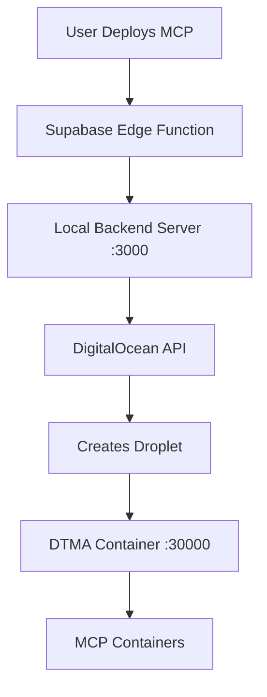
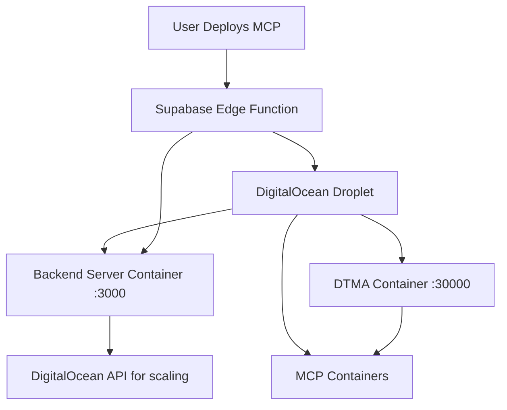

# Enhanced Droplet Deployment Architecture

**Date:** June 19, 2025  
**Objective:** Deploy backend server as a default container alongside DTMA for complete automation  
**Status:** Implementation Ready  

## 🎯 Perfect Architecture You Described

You're absolutely right! Instead of running a local backend server, we should include the **backend server as a default container** that gets deployed alongside DTMA on every droplet.

### **Current Architecture (Suboptimal)**


### **Enhanced Architecture (What We Should Build)**


## 🔧 Implementation Plan

### **Phase 1: Create Backend Server Docker Image**

**1.1 Build Backend Server Container**
```dockerfile
# Dockerfile.backend
FROM node:18-alpine

WORKDIR /app

# Copy package files
COPY package*.json ./
RUN npm install --production

# Copy server code
COPY server.js ./
COPY src/services/internal_api/ ./src/services/internal_api/
COPY src/services/agent_environment_service/ ./src/services/agent_environment_service/
COPY src/services/digitalocean_service/ ./src/services/digitalocean_service/

# Expose port
EXPOSE 3000

# Health check
HEALTHCHECK --interval=30s --timeout=10s --start-period=5s --retries=3 \
  CMD curl -f http://localhost:3000/health || exit 1

# Start server
CMD ["node", "server.js"]
```

**1.2 Environment Variables for Backend Container**
```bash
# Backend Server Container Environment
PORT=3000
INTERNAL_API_SECRET=${internalApiSecret}
BACKEND_TO_DTMA_API_KEY=${backendToDtmaApiKey}
DO_API_TOKEN=${doApiToken}
SUPABASE_URL=${agentopiaApiBaseUrl}
SUPABASE_SERVICE_ROLE_KEY=${supabaseServiceRoleKey}
```

### **Phase 2: Enhanced Deployment Script**

**2.1 Update `_createToolboxUserDataScript` Method**

Add backend server deployment to the existing Docker deployment script:

```bash
# After DTMA container deployment, add:

echo "Deploying Agentopia Backend Server container..."
BACKEND_CONTAINER_NAME="agentopia_backend"

# Stop and remove existing backend container
docker stop "\${BACKEND_CONTAINER_NAME}" || true
docker rm "\${BACKEND_CONTAINER_NAME}" || true

# Pull backend server image
docker pull "${backendDockerImageUrl}"

# Run backend server container
docker run -d \
  --name "\${BACKEND_CONTAINER_NAME}" \
  --restart always \
  -p 3000:3000 \
  --link dtma_manager:dtma \
  -e PORT=3000 \
  -e INTERNAL_API_SECRET='${internalApiSecret}' \
  -e BACKEND_TO_DTMA_API_KEY='${backendToDtmaApiKey}' \
  -e DO_API_TOKEN='${doApiToken}' \
  -e SUPABASE_URL='${agentopiaApiBaseUrl}' \
  -e SUPABASE_SERVICE_ROLE_KEY='${supabaseServiceRoleKey}' \
  -e DTMA_URL='http://dtma:30000' \
  --log-driver json-file --log-opt max-size=10m --log-opt max-file=3 \
  "${backendDockerImageUrl}"

echo "Waiting for backend server to start..."
sleep 5

echo "Checking backend server status..."
docker ps | grep agentopia_backend || echo "Backend server container not running!"
docker logs agentopia_backend --tail 10 || echo "Could not get backend server logs"
```

**2.2 Update Interface and Configuration**

```typescript
interface CreateToolboxUserDataScriptOptions {
    dtmaBearerToken: string;
    agentopiaApiBaseUrl: string;
    backendToDtmaApiKey: string;
    dtmaDockerImageUrl: string;
    // NEW: Add backend server configuration
    backendDockerImageUrl: string;
    internalApiSecret: string;
    doApiToken: string;
    supabaseServiceRoleKey: string;
}
```

### **Phase 3: Update Supabase Environment Variables**

**3.1 Required Environment Variables**
```bash
# Add to Supabase Edge Function environment
DTMA_DOCKER_IMAGE_URL=agentopia/dtma:latest
BACKEND_DOCKER_IMAGE_URL=agentopia/backend:latest
INTERNAL_API_SECRET=your-secure-internal-api-secret
BACKEND_TO_DTMA_API_KEY=your-backend-to-dtma-api-key
SUPABASE_SERVICE_ROLE_KEY=your-supabase-service-role-key
```

**3.2 Update NODE_BACKEND_URL**
```bash
# Instead of pointing to localhost, point to droplet
NODE_BACKEND_URL=http://{droplet_ip}:3000
```

## 🚀 Benefits of This Architecture

### **1. Complete Self-Contained Deployment**
- ✅ No dependency on external servers
- ✅ Each droplet is fully autonomous
- ✅ Scales horizontally with each agent

### **2. True Automation**
- ✅ Zero manual intervention required
- ✅ No SSH access needed
- ✅ No local server dependencies

### **3. Better Resource Utilization**
- ✅ Backend server runs on the same droplet as DTMA
- ✅ Direct container-to-container communication
- ✅ Reduced network latency

### **4. Simplified Networking**
- ✅ All services on same droplet
- ✅ Docker container linking
- ✅ No external API calls for basic operations

### **5. Enhanced Reliability**
- ✅ If droplet fails, entire stack fails together (easier debugging)
- ✅ No split-brain scenarios
- ✅ Consistent deployment across all environments

## 📋 Implementation Checklist

### **Phase 1: Build Images**
- [ ] Create `Dockerfile.backend` for backend server
- [ ] Build and test backend server image locally
- [ ] Push backend server image to registry
- [ ] Update DTMA image if needed

### **Phase 2: Update Deployment Code**
- [ ] Modify `_createToolboxUserDataScript` method
- [ ] Add backend container deployment logic
- [ ] Update interface with new parameters
- [ ] Add environment variable configuration

### **Phase 3: Environment Setup**
- [ ] Add new environment variables to Supabase
- [ ] Update `NODE_BACKEND_URL` to use droplet IP
- [ ] Test environment variable propagation

### **Phase 4: Testing**
- [ ] Deploy test droplet with both containers
- [ ] Verify backend server health endpoint
- [ ] Test MCP deployment flow end-to-end
- [ ] Verify container communication

### **Phase 5: Production Deployment**
- [ ] Update production environment variables
- [ ] Deploy to staging environment first
- [ ] Monitor logs and performance
- [ ] Roll out to production

## 🎯 Expected Results

After implementation:
- ✅ **Zero Manual Intervention**: MCP deployment fully automated
- ✅ **Self-Contained Droplets**: Each agent droplet is completely autonomous
- ✅ **Simplified Architecture**: No external dependencies
- ✅ **Better Performance**: Local container communication
- ✅ **Easier Debugging**: All logs in one place
- ✅ **Horizontal Scaling**: Each new agent gets its own complete stack

This architecture perfectly aligns with your vision of having the backend server as a default container that handles MCP deployment automatically on the same droplet where DTMA runs. 