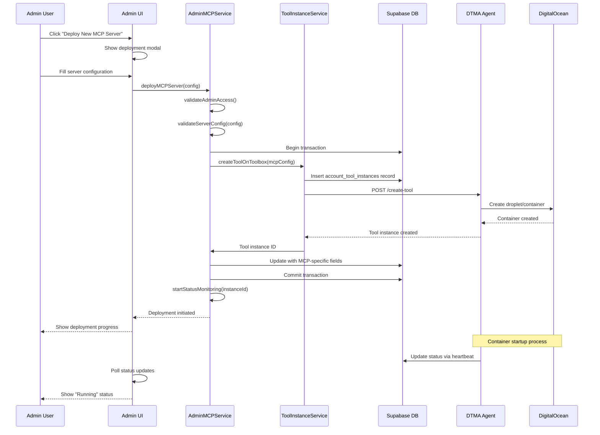
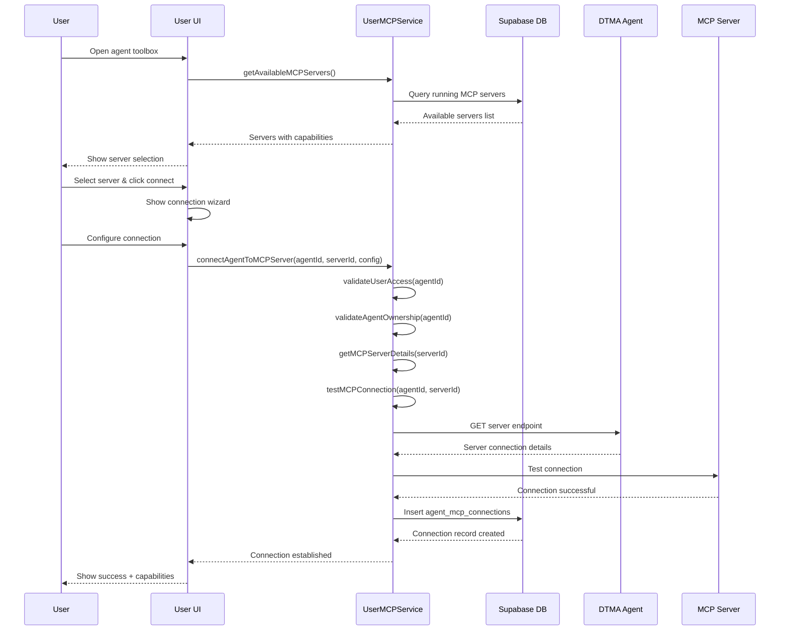
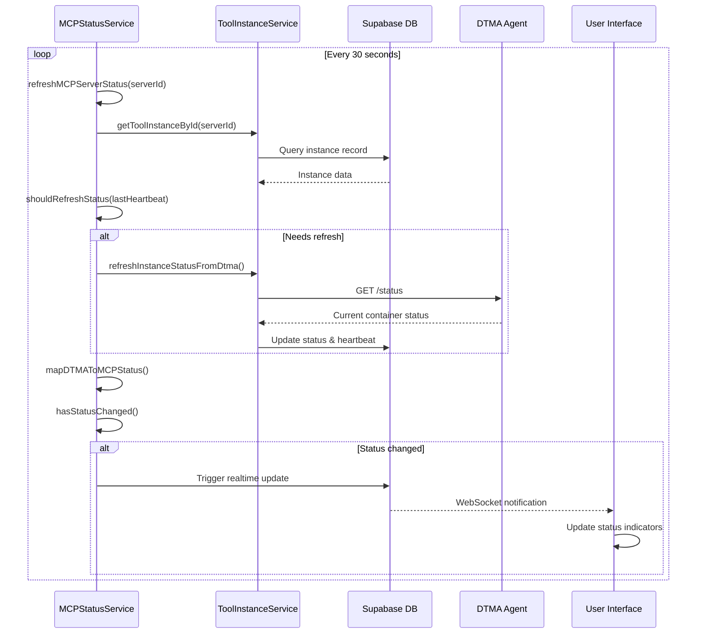
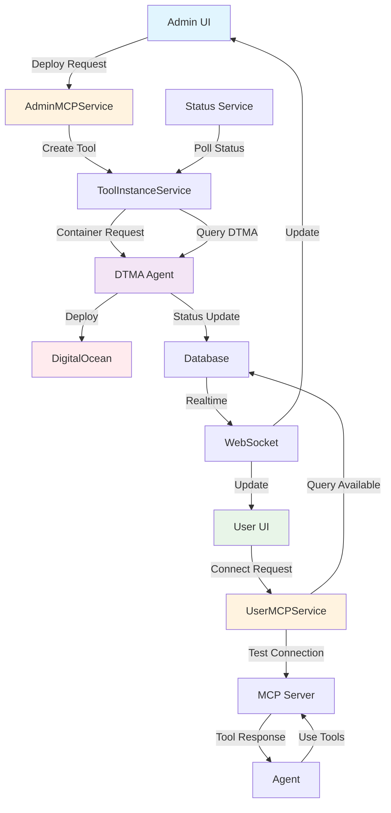

# Integration Flow Design Research

## 🎯 **Task**: Design end-to-end integration flows
**WBS Reference**: 3.3.1  
**Phase**: Design  
**Date**: January 1, 2025  

## 📋 **Research Objectives**

1. Design complete admin deployment flow from UI to DTMA infrastructure
2. Plan user connection flow from discovery to active connection
3. Design error handling and recovery flows for all scenarios
4. Plan status synchronization and monitoring flows
5. Design data flow between all system components

## 🔍 **Codebase Analysis**

### **Current DTMA Integration Flow**
From `src/services/tool_instance_service/manager.ts`:
- ✅ `createToolOnToolbox()` - creates tool instance via DTMA
- ✅ `startToolOnToolbox()` - starts container via DTMA
- ✅ `refreshInstanceStatusFromDtma()` - polls DTMA for status
- ✅ Complete tool lifecycle management

### **Current Database Transaction Patterns**
From existing services:
- ✅ Supabase transaction handling
- ✅ RLS policy enforcement
- ✅ Error handling and rollback patterns
- ✅ Audit logging for admin actions

### **Authentication Flow**
From `src/contexts/AuthContext.tsx`:
- ✅ User authentication via Supabase Auth
- ✅ Admin role validation
- ✅ Protected route handling

## 🏗️ **Integration Flow Architecture**

### **1. Admin MCP Server Deployment Flow**



#### **Admin Deployment Implementation**
```typescript
// AdminMCPService.deployMCPServer()
async deployMCPServer(config: MCPServerDeploymentConfig): Promise<MCPServerDeployment> {
  // 1. Validate admin access
  await this.validateAdminAccess();
  
  // 2. Validate configuration
  const validatedConfig = await this.validateServerConfig(config);
  
  // 3. Begin database transaction
  const { data, error } = await this.supabase.rpc('begin_transaction');
  if (error) throw error;
  
  try {
    // 4. Create via ToolInstanceService
    const toolInstance = await this.toolInstanceService.createToolOnToolbox({
      userId: 'admin-system',
      accountToolEnvironmentId: validatedConfig.environmentId,
      toolCatalogId: MCP_GENERIC_TOOL_CATALOG_ID,
      instanceNameOnToolbox: validatedConfig.serverName,
      customDockerImage: validatedConfig.dockerImage,
      environmentVariables: validatedConfig.environmentVariables,
      portMappings: validatedConfig.portMappings
    });
    
    // 5. Update with MCP-specific fields
    const { error: updateError } = await this.supabase
      .from('account_tool_instances')
      .update({
        mcp_server_type: validatedConfig.serverType,
        mcp_transport_type: validatedConfig.transport,
        mcp_endpoint_path: validatedConfig.endpointPath,
        mcp_server_capabilities: validatedConfig.capabilities,
        mcp_discovery_metadata: validatedConfig.discoveryMetadata
      })
      .eq('id', toolInstance.id);
      
    if (updateError) throw updateError;
    
    // 6. Commit transaction
    await this.supabase.rpc('commit_transaction');
    
    // 7. Start monitoring
    await this.statusService.startStatusMonitoring(toolInstance.id);
    
    // 8. Return deployment info
    return {
      id: toolInstance.id,
      status: 'deploying',
      serverName: validatedConfig.serverName,
      deployedAt: new Date(),
      estimatedReadyTime: new Date(Date.now() + 5 * 60 * 1000) // 5 minutes
    };
    
  } catch (error) {
    // Rollback on error
    await this.supabase.rpc('rollback_transaction');
    throw error;
  }
}
```

### **2. User Agent-MCP Connection Flow**



#### **User Connection Implementation**
```typescript
// UserMCPService.connectAgentToMCPServer()
async connectAgentToMCPServer(
  agentId: string, 
  mcpServerId: string, 
  config?: ConnectionConfig
): Promise<AgentMCPConnection> {
  
  // 1. Validate user access
  await this.validateUserAccess(agentId);
  await this.validateAgentOwnership(agentId);
  
  // 2. Get MCP server details
  const mcpServer = await this.getMCPServerDetails(mcpServerId);
  if (!mcpServer || mcpServer.status.state !== 'running') {
    throw new Error('MCP server not available for connections');
  }
  
  // 3. Build connection configuration
  const connectionConfig = this.buildConnectionConfig(mcpServer, config);
  
  // 4. Test connection before creating record
  const testResult = await this.testMCPConnection(agentId, mcpServerId);
  if (!testResult.success) {
    throw new Error(`Connection test failed: ${testResult.error}`);
  }
  
  // 5. Create connection record
  const { data, error } = await this.supabase
    .from('agent_mcp_connections')
    .insert({
      agent_id: agentId,
      mcp_server_instance_id: mcpServerId,
      connection_config: connectionConfig,
      is_active: true,
      connection_test_result: testResult
    })
    .select(`
      *,
      agent:agents(id, name),
      mcp_server:account_tool_instances(
        id,
        instance_name_on_toolbox,
        mcp_server_capabilities,
        account_tool_environment:account_tool_environments(
          public_ip_address,
          name
        )
      )
    `)
    .single();

  if (error) {
    if (error.code === '23505') { // Unique constraint violation
      throw new Error('Agent is already connected to this MCP server');
    }
    throw error;
  }

  // 6. Log connection event
  await this.logConnectionEvent(data.id, 'connected', 'User initiated connection');

  return data;
}
```

### **3. Status Synchronization Flow**



### **4. Error Handling and Recovery Flows**

#### **Deployment Failure Recovery**
```typescript
// Error handling in deployment flow
async deployMCPServer(config: MCPServerDeploymentConfig): Promise<MCPServerDeployment> {
  const deploymentId = uuidv4();
  
  try {
    // ... deployment logic
  } catch (error) {
    // Log the error
    await this.logDeploymentError(deploymentId, error);
    
    // Attempt cleanup
    try {
      await this.cleanupFailedDeployment(deploymentId);
    } catch (cleanupError) {
      console.error('Cleanup failed:', cleanupError);
    }
    
    // Determine error type and provide helpful message
    if (error.message.includes('DTMA')) {
      throw new Error('Infrastructure error: Unable to communicate with deployment service. Please try again.');
    } else if (error.message.includes('resource')) {
      throw new Error('Resource limit reached: Please contact administrator to increase capacity.');
    } else {
      throw new Error(`Deployment failed: ${error.message}`);
    }
  }
}
```

#### **Connection Failure Recovery**
```typescript
// Connection failure handling
async testMCPConnection(agentId: string, mcpServerId: string): Promise<ConnectionTest> {
  const maxRetries = 3;
  let lastError: string;
  
  for (let attempt = 1; attempt <= maxRetries; attempt++) {
    try {
      const mcpServer = await this.getMCPServerDetails(mcpServerId);
      const connectionUrl = this.buildConnectionUrl(mcpServer);
      
      // Test basic connectivity
      const response = await fetch(`${connectionUrl}/health`, {
        method: 'GET',
        timeout: 5000
      });
      
      if (!response.ok) {
        throw new Error(`HTTP ${response.status}: ${response.statusText}`);
      }
      
      // Test MCP protocol handshake
      const handshakeResult = await this.testMCPHandshake(connectionUrl);
      
      return {
        success: true,
        latency: handshakeResult.latency,
        capabilities: handshakeResult.capabilities,
        timestamp: new Date(),
        attempts: attempt
      };
      
    } catch (error) {
      lastError = error.message;
      
      if (attempt < maxRetries) {
        // Wait before retry (exponential backoff)
        await new Promise(resolve => setTimeout(resolve, 1000 * Math.pow(2, attempt - 1)));
      }
    }
  }
  
  return {
    success: false,
    error: `Connection failed after ${maxRetries} attempts: ${lastError}`,
    timestamp: new Date(),
    attempts: maxRetries
  };
}
```

### **5. Data Flow Architecture**



## 🔄 **Integration Patterns**

### **1. Service Layer Pattern**
- **AdminMCPService**: Admin operations with elevated privileges
- **UserMCPService**: User operations with ownership validation
- **MCPStatusService**: Status synchronization and monitoring
- **ToolInstanceService**: DTMA infrastructure integration

### **2. Event-Driven Updates**
- Database triggers for status changes
- WebSocket notifications for real-time UI updates
- Polling with exponential backoff for external services
- Event logging for audit trails

### **3. Error Boundary Pattern**
- Service-level error handling with cleanup
- UI error boundaries for graceful degradation
- Retry logic with circuit breaker pattern
- User-friendly error messages with actionable guidance

## ⚠️ **Cautionary Notes**

1. **Transaction Management**: Ensure proper rollback on partial failures
2. **Rate Limiting**: Implement rate limiting for DTMA API calls
3. **Connection Pooling**: Manage database connections efficiently
4. **Memory Leaks**: Clean up polling intervals and WebSocket subscriptions
5. **Race Conditions**: Handle concurrent operations carefully
6. **Data Consistency**: Ensure eventual consistency between services

## 🔄 **Future Intent**

1. **Immediate**: Implement basic flows with error handling and status sync
2. **Phase 2**: Add advanced retry logic, circuit breakers, and performance optimization
3. **Phase 3**: Add predictive error handling and automated recovery
4. **Long-term**: Machine learning for deployment optimization and failure prediction

## 🔗 **Dependencies**

- **Prerequisite**: All service classes (Admin/User/Status) designed and implemented
- **Required**: Database schema with RLS policies operational
- **Needed**: DTMA agent accessible and reliable
- **Depends on**: UI components implemented and integrated

---

**This design provides comprehensive integration flows that handle the complete lifecycle from deployment to user connections while maintaining reliability and user experience.** 