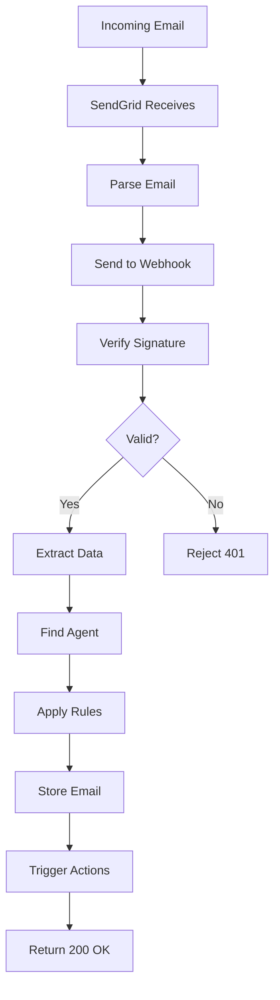

# SendGrid Integration Implementation Strategy

## Date: August 2, 2025
## Related WBS Items: All phases

## Overview
This document provides a detailed implementation strategy for integrating SendGrid into Agentopia, including technical approach, dependencies, and risk mitigation.

## Implementation Phases

### Phase 1: Core Infrastructure (Week 1)

#### Day 1-2: Database Setup
1. **Create migration files**
   ```bash
   supabase migration new sendgrid_integration
   supabase migration new sendgrid_email_routing
   supabase migration new sendgrid_webhooks
   ```

2. **Implement core tables**
   - sendgrid_configurations
   - agent_sendgrid_permissions
   - agent_email_addresses
   - Test migrations locally

3. **Add RLS policies**
   - User isolation policies
   - Service role policies
   - Test with different user contexts

4. **Create database functions**
   - get_sendgrid_tools()
   - process_inbound_email()
   - validate_agent_permissions()

#### Day 3-4: Vault Integration
1. **Implement secure API key storage**
   ```typescript
   // Extend VaultService
   async storeSendGridAPIKey(userId: string, apiKey: string): Promise<string> {
     const keyId = await this.createSecret(
       `sendgrid_api_key_${userId}`,
       apiKey,
       'SendGrid API key for user'
     );
     return keyId;
   }
   ```

2. **Create retrieval functions**
   - Secure key retrieval
   - Key rotation support
   - Audit logging

#### Day 5: Tool Definitions
1. **Create sendgrid_tools.ts**
   - Define all tool schemas
   - Add permission mappings
   - Create example payloads

2. **Update FunctionCallingManager**
   - Add getSendGridTools()
   - Implement executeSendGridTool()
   - Add error handling

### Phase 2: Backend Services (Week 2)

#### Day 6-7: SendGrid API Edge Function
1. **Create sendgrid-api function**
   ```typescript
   // supabase/functions/sendgrid-api/index.ts
   serve(async (req) => {
     const { action, params, agent_id } = await req.json();
     
     switch (action) {
       case 'send_email':
         return await sendEmail(params);
       case 'send_bulk_email':
         return await sendBulkEmail(params);
       // ... other actions
     }
   });
   ```

2. **Implement core operations**
   - Email sending
   - Template management
   - Status checking
   - Analytics retrieval

#### Day 8-9: Webhook Handlers
1. **Create sendgrid-inbound function**
   - Multipart form parsing
   - Email storage
   - Routing logic
   - Attachment handling

2. **Create webhook verification function**
   - Signature validation
   - Timestamp verification
   - Security checks

#### Day 10: Integration Testing
1. **Test tool execution flow**
   - Agent → Chat → FunctionCalling → SendGrid API
   - Verify permissions at each step
   - Test error scenarios

2. **Test webhook processing**
   - Send test emails
   - Verify routing
   - Check attachment handling

### Phase 3: Frontend Implementation (Week 3)

#### Day 11-12: Integration UI
1. **Create SendGridIntegration component**
   - API key setup flow
   - Configuration management
   - Status indicators

2. **Add to integrations page**
   - Integration card
   - Setup modal
   - Success feedback

#### Day 13-14: Agent Email Settings
1. **Create AgentEmailSettings component**
   - Permission toggles
   - Email address assignment
   - Usage limits configuration

2. **Integrate with AgentEdit**
   - Add email tab
   - Connect to backend
   - Real-time updates

#### Day 15: Email Management UI
1. **Create EmailRoutingRules component**
   - Rule builder interface
   - Priority management
   - Testing capability

2. **Create InboxViewer component**
   - Email list
   - Detail view
   - Search/filter functionality

### Phase 4: Testing & Refinement (Week 4)

#### Day 16-17: Comprehensive Testing
1. **Unit tests**
   ```typescript
   describe('SendGrid Integration', () => {
     test('should validate API key', async () => {
       const result = await validateAPIKey('SG.test');
       expect(result.valid).toBe(true);
     });
     
     test('should handle rate limits', async () => {
       // Test rate limiting logic
     });
   });
   ```

2. **Integration tests**
   - End-to-end email flow
   - Webhook processing
   - Permission validation

#### Day 18-19: Security Audit
1. **Security review**
   - API key encryption
   - Webhook validation
   - Input sanitization
   - Rate limiting

2. **Penetration testing**
   - Attempt unauthorized access
   - Test injection attacks
   - Verify data isolation

#### Day 20-21: Performance Optimization
1. **Database optimization**
   - Add missing indexes
   - Optimize queries
   - Test with load

2. **Frontend optimization**
   - Lazy loading
   - Caching strategy
   - Bundle size reduction

## Technical Implementation Details

### API Key Validation
```typescript
async function validateSendGridAPIKey(apiKey: string): Promise<ValidationResult> {
  try {
    const response = await fetch('https://api.sendgrid.com/v3/scopes', {
      headers: {
        'Authorization': `Bearer ${apiKey}`,
        'Content-Type': 'application/json'
      }
    });
    
    if (response.ok) {
      const scopes = await response.json();
      return {
        valid: true,
        message: 'API key is valid',
        scopes: scopes.scopes
      };
    } else {
      return {
        valid: false,
        message: 'Invalid API key'
      };
    }
  } catch (error) {
    return {
      valid: false,
      message: 'Failed to validate API key'
    };
  }
}
```

### Email Sending Implementation
```typescript
async function sendEmail(params: SendEmailParams): Promise<SendEmailResult> {
  const sgMail = require('@sendgrid/mail');
  sgMail.setApiKey(await getAPIKey(params.userId));
  
  const msg = {
    to: params.to,
    from: params.from || getDefaultSender(params.userId),
    subject: params.subject,
    text: params.text,
    html: params.html,
    attachments: params.attachments?.map(att => ({
      content: att.content,
      filename: att.filename,
      type: att.type,
      disposition: att.disposition || 'attachment'
    }))
  };
  
  try {
    const [response] = await sgMail.send(msg);
    return {
      success: true,
      messageId: response.headers['x-message-id'],
      statusCode: response.statusCode
    };
  } catch (error) {
    console.error('SendGrid error:', error);
    throw new Error(`Failed to send email: ${error.message}`);
  }
}
```

### Webhook Processing Flow


## Dependency Management

### NPM Packages
```json
{
  "dependencies": {
    "@sendgrid/mail": "^8.1.0",
    "@sendgrid/client": "^8.1.0",
    "multipart-parser": "^1.0.0",
    "dompurify": "^3.0.0"
  }
}
```

### Environment Variables
```env
# SendGrid Configuration
SENDGRID_WEBHOOK_PUBLIC_KEY=MFkw...
SENDGRID_DEFAULT_FROM_EMAIL=noreply@myapp.com
SENDGRID_INBOUND_DOMAIN=inbox.myapp.com
SENDGRID_MAX_EMAIL_SIZE=10485760  # 10MB
```

## Risk Mitigation

### 1. API Key Security
**Risk**: Exposed API keys
**Mitigation**: 
- Encrypt all keys in Vault
- Never log keys
- Rotate keys regularly
- Monitor for unauthorized use

### 2. Email Spoofing
**Risk**: Forged sender addresses
**Mitigation**:
- Enforce SPF/DKIM validation
- Verify sender domains
- Add warning labels for external emails

### 3. Webhook Abuse
**Risk**: Fake webhook calls
**Mitigation**:
- Always verify signatures
- Implement rate limiting
- Validate payload structure
- Monitor suspicious patterns

### 4. Data Privacy
**Risk**: Sensitive email content exposure
**Mitigation**:
- Encrypt email content at rest
- Implement access controls
- Audit all access
- Allow data deletion

### 5. Service Interruption
**Risk**: SendGrid outage
**Mitigation**:
- Implement retry logic
- Queue failed operations
- Monitor service status
- Have fallback notifications

## Monitoring & Alerts

### Key Metrics
1. **API Success Rate**
   ```sql
   SELECT 
     COUNT(*) FILTER (WHERE status = 'success') * 100.0 / COUNT(*) as success_rate
   FROM sendgrid_operation_logs
   WHERE created_at > NOW() - INTERVAL '1 hour';
   ```

2. **Webhook Processing Time**
   ```sql
   SELECT 
     AVG(processing_time_ms) as avg_time,
     MAX(processing_time_ms) as max_time
   FROM webhook_logs
   WHERE webhook_type = 'inbound_parse';
   ```

3. **Email Delivery Rate**
   - Track bounces, deferrals
   - Monitor spam reports
   - Check engagement metrics

### Alert Conditions
1. API success rate < 95%
2. Webhook processing time > 5 seconds
3. Failed webhook validations > 10/hour
4. API rate limit approaching
5. Unusual sending patterns

## Rollout Strategy

### 1. Internal Testing (Days 22-23)
- Test with team accounts
- Verify all flows
- Fix critical issues

### 2. Beta Release (Days 24-25)
- Select beta users
- Monitor closely
- Gather feedback

### 3. Gradual Rollout (Days 26-27)
- 10% of users initially
- Monitor metrics
- Increase gradually

### 4. Full Release (Day 28)
- Enable for all users
- Announce feature
- Monitor support tickets

## Success Metrics

1. **Technical Metrics**
   - 99.9% uptime
   - <500ms average response time
   - <0.1% email failure rate

2. **User Metrics**
   - 50% of users enable integration
   - 80% satisfaction rate
   - <5% support ticket rate

3. **Business Metrics**
   - Increased agent usage
   - Higher user retention
   - New customer acquisition

## Documentation Requirements

1. **User Documentation**
   - Setup guide
   - Video tutorial
   - FAQ section
   - Troubleshooting guide

2. **Developer Documentation**
   - API reference
   - Code examples
   - Integration guide
   - Security best practices

3. **Internal Documentation**
   - Architecture diagram
   - Deployment guide
   - Monitoring setup
   - Incident response

## Post-Launch Improvements

1. **Phase 1 Enhancements**
   - Email templates library
   - Advanced analytics
   - A/B testing support

2. **Phase 2 Enhancements**
   - Marketing campaign tools
   - Contact management
   - Automation workflows

3. **Phase 3 Enhancements**
   - Multi-channel support
   - Advanced personalization
   - AI-powered insights