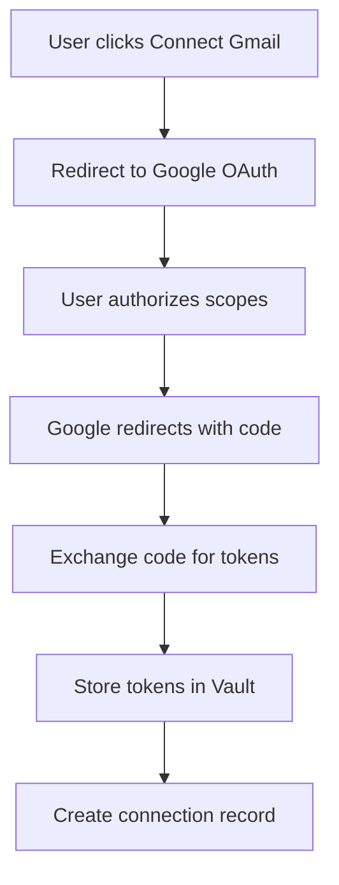

# Gmail OAuth Integration

## Overview

The Gmail OAuth integration enables agents to access and search user emails through the Gmail API using OAuth 2.0 authentication. This provides secure, scoped access without storing user passwords.

## OAuth Configuration

### Google Cloud Console Setup

1. **Create Project**
   - Go to [Google Cloud Console](https://console.cloud.google.com)
   - Create new project or select existing
   - Enable Gmail API

2. **Configure OAuth Consent Screen**
   ```
   Application Type: External (or Internal for G Suite)
   Scopes Required:
   - https://www.googleapis.com/auth/gmail.readonly
   - https://www.googleapis.com/auth/gmail.modify (optional)
   - https://www.googleapis.com/auth/gmail.send (optional)
   ```

3. **Create OAuth Credentials**
   ```
   Application Type: Web application
   Authorized redirect URIs:
   - https://your-domain.com/api/auth/callback/google
   - http://localhost:3000/api/auth/callback/google (development)
   ```

### Environment Variables

```bash
# Supabase Edge Function Secrets
GOOGLE_CLIENT_ID=your-client-id.apps.googleusercontent.com
GOOGLE_CLIENT_SECRET=your-client-secret
GOOGLE_REDIRECT_URI=https://your-domain.com/api/auth/callback/google
```

## Authentication Flow

### 1. Initial Authorization



### 2. Implementation

```typescript
// Frontend: Initiate OAuth flow
const initiateGmailAuth = () => {
  const params = new URLSearchParams({
    client_id: GOOGLE_CLIENT_ID,
    redirect_uri: GOOGLE_REDIRECT_URI,
    response_type: 'code',
    scope: 'https://www.googleapis.com/auth/gmail.readonly',
    access_type: 'offline',
    prompt: 'consent'
  });
  
  window.location.href = 
    `https://accounts.google.com/o/oauth2/v2/auth?${params}`;
};

// Backend: Handle callback
async function handleGoogleCallback(code: string) {
  // Exchange code for tokens
  const tokenResponse = await fetch(
    'https://oauth2.googleapis.com/token',
    {
      method: 'POST',
      headers: { 'Content-Type': 'application/x-www-form-urlencoded' },
      body: new URLSearchParams({
        code,
        client_id: GOOGLE_CLIENT_ID,
        client_secret: GOOGLE_CLIENT_SECRET,
        redirect_uri: GOOGLE_REDIRECT_URI,
        grant_type: 'authorization_code'
      })
    }
  );
  
  const tokens = await tokenResponse.json();
  
  // Store in Vault
  const { data: accessVault } = await supabase.rpc('vault_encrypt', {
    secret: tokens.access_token
  });
  
  const { data: refreshVault } = await supabase.rpc('vault_encrypt', {
    secret: tokens.refresh_token
  });
  
  // Create connection record
  await supabase.from('user_oauth_connections').insert({
    user_id: userId,
    provider_id: gmailProviderId,
    credential_type: 'oauth',
    vault_access_token_id: accessVault.id,
    vault_refresh_token_id: refreshVault.id,
    token_expires_at: new Date(Date.now() + tokens.expires_in * 1000),
    connection_status: 'connected'
  });
}
```

## Token Management

### Token Refresh Flow

Location: `supabase/functions/oauth-refresh/index.ts`

```typescript
async function refreshGmailToken(connectionId: string) {
  // Get connection
  const { data: connection } = await supabase
    .from('user_oauth_connections')
    .select('*')
    .eq('id', connectionId)
    .single();
  
  // Decrypt refresh token from Vault
  const { data: refreshToken } = await supabase.rpc('vault_decrypt', {
    vault_id: connection.vault_refresh_token_id
  });
  
  // Request new tokens from Google
  const response = await fetch('https://oauth2.googleapis.com/token', {
    method: 'POST',
    headers: { 'Content-Type': 'application/x-www-form-urlencoded' },
    body: new URLSearchParams({
      refresh_token: refreshToken.decrypted_secret,
      client_id: GOOGLE_CLIENT_ID,
      client_secret: GOOGLE_CLIENT_SECRET,
      grant_type: 'refresh_token'
    })
  });
  
  if (!response.ok) {
    const error = await response.json();
    if (error.error === 'invalid_grant') {
      // Token expired - update status
      await supabase
        .from('user_oauth_connections')
        .update({ connection_status: 'expired' })
        .eq('id', connectionId);
      
      throw new Error(
        'Your Gmail connection has expired. Please disconnect and reconnect.'
      );
    }
    throw new Error(`Token refresh failed: ${error.error_description}`);
  }
  
  const newTokens = await response.json();
  
  // Update stored tokens
  await supabase
    .from('user_oauth_connections')
    .update({
      vault_access_token_id: newTokens.access_token,
      token_expires_at: new Date(Date.now() + newTokens.expires_in * 1000),
      last_token_refresh: new Date()
    })
    .eq('id', connectionId);
  
  return newTokens.access_token;
}
```

### Token Expiry Handling

```typescript
// Check and refresh if needed
async function getValidAccessToken(connectionId: string): Promise<string> {
  const { data: connection } = await supabase
    .from('user_oauth_connections')
    .select('token_expires_at, vault_access_token_id')
    .eq('id', connectionId)
    .single();
  
  const now = new Date();
  const expiresAt = new Date(connection.token_expires_at);
  const bufferTime = 5 * 60 * 1000; // 5 minutes buffer
  
  if (expiresAt.getTime() - now.getTime() < bufferTime) {
    // Token expired or expiring soon - refresh
    return await refreshGmailToken(connectionId);
  }
  
  // Token still valid - decrypt and return
  const { data: token } = await supabase.rpc('vault_decrypt', {
    vault_id: connection.vault_access_token_id
  });
  
  return token.decrypted_secret;
}
```

## Gmail API Operations

### Edge Function: `gmail-api`

Location: `supabase/functions/gmail-api/index.ts`

```typescript
import { serve } from 'https://deno.land/std@0.168.0/http/server.ts';
import { google } from 'https://esm.sh/googleapis@118.0.0';

serve(async (req) => {
  const { action, connectionId, agentId, params } = await req.json();
  
  // Get valid access token
  const accessToken = await getValidAccessToken(connectionId);
  
  // Initialize Gmail client
  const auth = new google.auth.OAuth2();
  auth.setCredentials({ access_token: accessToken });
  const gmail = google.gmail({ version: 'v1', auth });
  
  // Execute action
  switch (action) {
    case 'list':
      return await listMessages(gmail, params);
    case 'get':
      return await getMessage(gmail, params);
    case 'search':
      return await searchMessages(gmail, params);
    case 'getAttachment':
      return await getAttachment(gmail, params);
    default:
      throw new Error(`Unknown action: ${action}`);
  }
});
```

### Available Operations

#### List Messages
```typescript
async function listMessages(gmail: any, params: any) {
  const response = await gmail.users.messages.list({
    userId: 'me',
    maxResults: params.maxResults || 10,
    q: params.query || '',
    labelIds: params.labelIds || ['INBOX']
  });
  
  return response.data;
}
```

#### Get Message
```typescript
async function getMessage(gmail: any, params: any) {
  const response = await gmail.users.messages.get({
    userId: 'me',
    id: params.messageId,
    format: params.format || 'full'
  });
  
  return response.data;
}
```

#### Search Messages
```typescript
async function searchMessages(gmail: any, params: any) {
  // Apply permission-based filters
  const permissions = await getAgentPermissions(params.agentId);
  
  let query = params.query;
  if (permissions.date_range_days) {
    const date = new Date();
    date.setDate(date.getDate() - permissions.date_range_days);
    query += ` after:${date.toISOString().split('T')[0]}`;
  }
  
  const response = await gmail.users.messages.list({
    userId: 'me',
    q: query,
    maxResults: Math.min(
      params.maxResults || 10,
      permissions.max_results || 50
    ),
    labelIds: permissions.allowed_labels || ['INBOX']
  });
  
  // Fetch full message details
  const messages = await Promise.all(
    response.data.messages.map(msg =>
      gmail.users.messages.get({
        userId: 'me',
        id: msg.id,
        format: 'metadata',
        metadataHeaders: ['From', 'To', 'Subject', 'Date']
      })
    )
  );
  
  return messages.map(m => m.data);
}
```

## Agent Integration

### Function Calling

Agents can access Gmail through function calling:

```json
{
  "name": "search_emails",
  "description": "Search Gmail for emails matching criteria",
  "parameters": {
    "type": "object",
    "properties": {
      "query": {
        "type": "string",
        "description": "Gmail search query (e.g., 'from:user@example.com subject:invoice')"
      },
      "max_results": {
        "type": "integer",
        "description": "Maximum number of results",
        "default": 10
      },
      "include_body": {
        "type": "boolean",
        "description": "Include email body in results",
        "default": false
      }
    },
    "required": ["query"]
  }
}
```

### Execution Example

```typescript
// Agent executor
async function executeGmailSearch(
  agentId: string,
  params: any
) {
  // Get agent's Gmail connection
  const { data: permission } = await supabase
    .from('agent_oauth_permissions')
    .select('connection_id, permissions')
    .eq('agent_id', agentId)
    .single();
  
  if (!permission) {
    throw new Error('Agent has no Gmail access');
  }
  
  // Call Gmail API edge function
  const { data, error } = await supabase.functions.invoke('gmail-api', {
    body: {
      action: 'search',
      connectionId: permission.connection_id,
      agentId: agentId,
      params: {
        query: params.query,
        maxResults: params.max_results
      }
    }
  });
  
  if (error) throw error;
  return data;
}
```

## Security Considerations

### Scope Management

```typescript
const GMAIL_SCOPES = {
  READ_ONLY: 'https://www.googleapis.com/auth/gmail.readonly',
  MODIFY: 'https://www.googleapis.com/auth/gmail.modify',
  SEND: 'https://www.googleapis.com/auth/gmail.send',
  COMPOSE: 'https://www.googleapis.com/auth/gmail.compose',
  LABELS: 'https://www.googleapis.com/auth/gmail.labels'
};

// Request minimal necessary scopes
function getRequiredScopes(permissions: any): string[] {
  const scopes = [GMAIL_SCOPES.READ_ONLY];
  
  if (permissions.can_modify) scopes.push(GMAIL_SCOPES.MODIFY);
  if (permissions.can_send) scopes.push(GMAIL_SCOPES.SEND);
  if (permissions.can_manage_labels) scopes.push(GMAIL_SCOPES.LABELS);
  
  return scopes;
}
```

### Data Privacy

1. **Minimal Data Storage**: Only store tokens, not email content
2. **Encryption at Rest**: All tokens in Vault
3. **Audit Logging**: Track all Gmail API access
4. **Data Retention**: Auto-delete old audit logs
5. **User Control**: Easy revocation and data deletion

### Rate Limiting

```typescript
// Gmail API quotas
const GMAIL_QUOTAS = {
  QUERIES_PER_SECOND: 25,
  QUERIES_PER_DAY: 1_000_000_000,
  QUERIES_PER_USER_PER_SECOND: 5
};

// Implement rate limiting
const rateLimiter = new RateLimiter({
  windowMs: 1000,
  max: GMAIL_QUOTAS.QUERIES_PER_USER_PER_SECOND
});

async function checkGmailRateLimit(userId: string): Promise<void> {
  const allowed = await rateLimiter.check(userId);
  if (!allowed) {
    throw new Error('Gmail API rate limit exceeded. Please try again later.');
  }
}
```

## Error Handling

### Common Errors and Solutions

#### 1. Invalid Grant Error
```typescript
if (error.error === 'invalid_grant') {
  // Token has been revoked or expired
  await updateConnectionStatus(connectionId, 'expired');
  
  return {
    error: 'Your Gmail connection has expired',
    action: 'reconnect',
    message: 'Please disconnect and reconnect your Gmail account'
  };
}
```

#### 2. Insufficient Permissions
```typescript
if (error.code === 403 && error.message.includes('insufficient')) {
  return {
    error: 'Insufficient permissions',
    action: 'update_scopes',
    message: 'This action requires additional Gmail permissions'
  };
}
```

#### 3. Quota Exceeded
```typescript
if (error.code === 429) {
  const retryAfter = error.retryAfter || 60;
  return {
    error: 'Rate limit exceeded',
    action: 'retry',
    retryAfter: retryAfter,
    message: `Please try again in ${retryAfter} seconds`
  };
}
```

## Testing

### Manual Testing Script

```javascript
// scripts/test_gmail_integration.js
const { createClient } = require('@supabase/supabase-js');

async function testGmailIntegration() {
  const supabase = createClient(
    process.env.SUPABASE_URL,
    process.env.SUPABASE_ANON_KEY
  );
  
  // Test search
  const { data, error } = await supabase.functions.invoke('gmail-api', {
    body: {
      action: 'search',
      connectionId: 'your-connection-id',
      params: {
        query: 'is:unread',
        maxResults: 5
      }
    }
  });
  
  console.log('Search results:', data);
  if (error) console.error('Error:', error);
}
```

### Integration Tests

```typescript
describe('Gmail Integration', () => {
  it('should refresh expired token', async () => {
    const newToken = await refreshGmailToken('connection-id');
    expect(newToken).toBeDefined();
    expect(typeof newToken).toBe('string');
  });
  
  it('should search emails with permissions', async () => {
    const results = await searchMessages(gmailClient, {
      query: 'from:test@example.com',
      agentId: 'agent-id'
    });
    expect(results).toHaveLength(10); // Respects max_results permission
  });
});
```

## Troubleshooting

### Token Refresh Issues

**Problem**: Refresh token expired after 7 days of inactivity

**Solution**: 
1. Verify app in Google Cloud Console
2. Implement automated token refresh
3. Notify users before expiry

```typescript
// Proactive refresh check
async function checkTokenHealth() {
  const connections = await getGmailConnections();
  
  for (const conn of connections) {
    const daysSinceRefresh = 
      (Date.now() - new Date(conn.last_token_refresh).getTime()) 
      / (1000 * 60 * 60 * 24);
    
    if (daysSinceRefresh > 5) {
      // Refresh proactively
      await refreshGmailToken(conn.id);
    }
  }
}
```

### Connection Status Sync

**Problem**: UI shows different status than database

**Solution**: Use centralized `useConnections` hook

```typescript
// Always use the hook for consistent data
const { connections, refetch } = useConnections();

// After any operation that might change status
await refetch();
```

## Best Practices

1. **Request Minimal Scopes**: Only request necessary permissions
2. **Handle Expiry Gracefully**: Proactive refresh and clear user messaging
3. **Implement Retry Logic**: Handle transient failures
4. **Cache When Possible**: Reduce API calls for repeated queries
5. **Monitor Usage**: Track API quotas and costs
6. **Secure Token Storage**: Always use Vault, never plain text
7. **Audit Access**: Log all Gmail API operations
8. **User Privacy**: Clear consent and easy revocation

## Future Enhancements

1. **Batch Operations**: Process multiple emails efficiently
2. **Smart Search**: AI-enhanced query understanding
3. **Email Templates**: Predefined search patterns
4. **Attachment Processing**: Extract and analyze attachments
5. **Thread Management**: Handle email conversations
6. **Label Management**: Create and manage Gmail labels
7. **Draft Support**: Create and manage email drafts
8. **Calendar Integration**: Link with Google Calendar events
