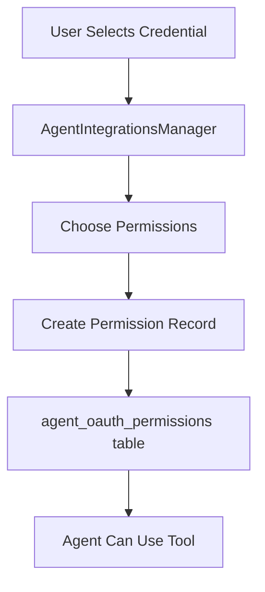
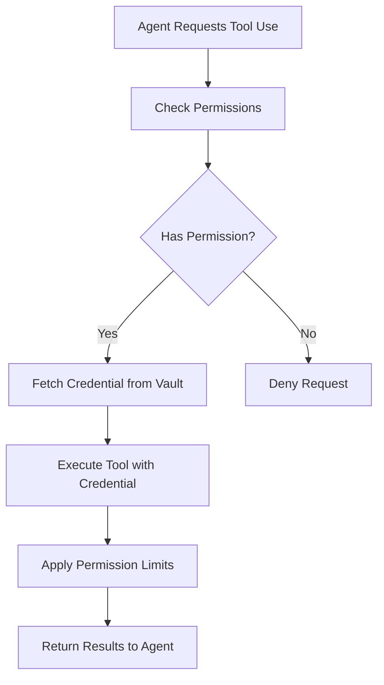
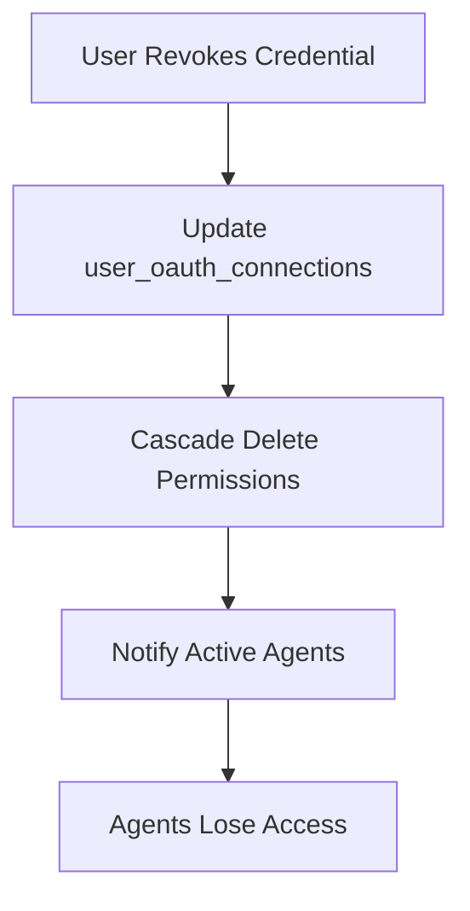

# Agent Permissions System

## Overview

The agent permissions system controls how AI agents access and use credentials for external tools. It provides granular control over what actions agents can perform with user-connected integrations.

## Architecture

### Permission Model

```typescript
interface AgentPermission {
  id: string;
  agent_id: string;
  connection_id: string;  // References user_oauth_connections
  permissions: {
    // Provider-specific permissions
    [key: string]: any;
  };
  created_at: string;
  updated_at: string;
}
```

### Database Schema

#### `agent_oauth_permissions`

```sql
CREATE TABLE agent_oauth_permissions (
  id UUID PRIMARY KEY DEFAULT gen_random_uuid(),
  agent_id UUID NOT NULL REFERENCES agents(id) ON DELETE CASCADE,
  connection_id UUID NOT NULL REFERENCES user_oauth_connections(id) ON DELETE CASCADE,
  permissions JSONB DEFAULT '{}',
  created_at TIMESTAMPTZ DEFAULT NOW(),
  updated_at TIMESTAMPTZ DEFAULT NOW(),
  UNIQUE(agent_id, connection_id)
);
```

### RLS Policies

```sql
-- Users can only manage permissions for their own agents
CREATE POLICY "Users can manage their agent permissions"
ON agent_oauth_permissions
FOR ALL
USING (
  agent_id IN (
    SELECT id FROM agents WHERE user_id = auth.uid()
  )
);
```

## Permission Types by Provider

### Gmail Permissions

```json
{
  "read_emails": true,
  "search_emails": true,
  "read_attachments": false,
  "send_emails": false,
  "modify_labels": false,
  "max_results": 50,
  "allowed_labels": ["INBOX", "SENT"],
  "date_range_days": 30
}
```

### Web Search Permissions

```json
{
  "enabled": true,
  "max_queries_per_day": 100,
  "max_results_per_query": 10,
  "safe_search": true,
  "allowed_domains": [],
  "blocked_domains": [],
  "geo_location": "US"
}
```

### MCP Server Permissions

```json
{
  "enabled": true,
  "allowed_tools": ["*"],  // Or specific tool list
  "max_executions_per_hour": 100,
  "timeout_seconds": 30,
  "resource_limits": {
    "max_memory_mb": 512,
    "max_cpu_percent": 50
  }
}
```

## Permission Flow

### 1. Assignment Flow



### 2. Execution Flow



### 3. Revocation Flow



## Frontend Implementation

### AgentIntegrationsManager Component

Located at: `src/components/agent-edit/AgentIntegrationsManager.tsx`

```typescript
// Key functions
const handleAddIntegration = async (credential: Credential) => {
  // Create permission record
  const permission = await createAgentPermission({
    agent_id: agentId,
    connection_id: credential.id,
    permissions: getDefaultPermissions(credential.provider)
  });
};

const handleUpdatePermissions = async (
  connectionId: string, 
  permissions: any
) => {
  // Update existing permissions
  await updateAgentPermission(agentId, connectionId, permissions);
};

const handleRemoveIntegration = async (connectionId: string) => {
  // Remove permission record
  await deleteAgentPermission(agentId, connectionId);
};
```

### Permission UI Components

#### PermissionToggle
```typescript
<PermissionToggle
  label="Read Emails"
  value={permissions.read_emails}
  onChange={(value) => updatePermission('read_emails', value)}
/>
```

#### PermissionSlider
```typescript
<PermissionSlider
  label="Max Results"
  min={1}
  max={100}
  value={permissions.max_results}
  onChange={(value) => updatePermission('max_results', value)}
/>
```

#### PermissionSelect
```typescript
<PermissionSelect
  label="Allowed Labels"
  options={['INBOX', 'SENT', 'DRAFTS', 'SPAM']}
  value={permissions.allowed_labels}
  onChange={(value) => updatePermission('allowed_labels', value)}
  multiple
/>
```

## Backend Implementation

### Edge Function Permission Check

```typescript
// In edge function (e.g., gmail-api/index.ts)
async function checkAgentPermissions(
  agentId: string,
  connectionId: string,
  requiredPermission: string
): Promise<boolean> {
  const { data: permission } = await supabase
    .from('agent_oauth_permissions')
    .select('permissions')
    .eq('agent_id', agentId)
    .eq('connection_id', connectionId)
    .single();

  if (!permission) return false;
  
  return permission.permissions[requiredPermission] === true;
}
```

### Permission Enforcement

```typescript
// Example: Gmail search with permissions
async function searchEmails(
  agentId: string,
  connectionId: string,
  query: string
) {
  // Check base permission
  if (!await checkAgentPermissions(agentId, connectionId, 'search_emails')) {
    throw new Error('Agent lacks email search permission');
  }
  
  // Get permission limits
  const { data: permission } = await supabase
    .from('agent_oauth_permissions')
    .select('permissions')
    .eq('agent_id', agentId)
    .eq('connection_id', connectionId)
    .single();
  
  const maxResults = permission?.permissions?.max_results || 10;
  const allowedLabels = permission?.permissions?.allowed_labels || ['INBOX'];
  
  // Apply limits to search
  const results = await gmail.users.messages.list({
    userId: 'me',
    q: query,
    maxResults: Math.min(maxResults, 100),
    labelIds: allowedLabels
  });
  
  return results;
}
```

## Permission Templates

### Minimal Access Template
```json
{
  "gmail": {
    "read_emails": true,
    "search_emails": false,
    "max_results": 10,
    "allowed_labels": ["INBOX"],
    "date_range_days": 7
  },
  "web_search": {
    "enabled": true,
    "max_queries_per_day": 10,
    "max_results_per_query": 5,
    "safe_search": true
  }
}
```

### Standard Access Template
```json
{
  "gmail": {
    "read_emails": true,
    "search_emails": true,
    "max_results": 50,
    "allowed_labels": ["INBOX", "SENT"],
    "date_range_days": 30
  },
  "web_search": {
    "enabled": true,
    "max_queries_per_day": 100,
    "max_results_per_query": 10,
    "safe_search": true
  }
}
```

### Full Access Template
```json
{
  "gmail": {
    "read_emails": true,
    "search_emails": true,
    "read_attachments": true,
    "max_results": 100,
    "allowed_labels": ["*"],
    "date_range_days": 365
  },
  "web_search": {
    "enabled": true,
    "max_queries_per_day": 1000,
    "max_results_per_query": 50,
    "safe_search": false
  }
}
```

## Security Considerations

### Principle of Least Privilege

1. **Default Deny**: Agents have no permissions by default
2. **Explicit Grant**: Each permission must be explicitly granted
3. **Granular Control**: Fine-grained permissions per provider
4. **Time Limits**: Consider implementing time-based permission expiry

### Audit Logging

```typescript
// Log permission changes
async function logPermissionChange(
  userId: string,
  agentId: string,
  connectionId: string,
  action: 'grant' | 'update' | 'revoke',
  permissions: any
) {
  await supabase.from('audit_logs').insert({
    user_id: userId,
    resource_type: 'agent_permission',
    resource_id: `${agentId}:${connectionId}`,
    action: action,
    details: { permissions },
    timestamp: new Date().toISOString()
  });
}
```

### Rate Limiting

```typescript
// Implement rate limiting per agent
const rateLimiter = new Map<string, RateLimitInfo>();

function checkRateLimit(
  agentId: string,
  action: string,
  limit: number,
  window: number
): boolean {
  const key = `${agentId}:${action}`;
  const now = Date.now();
  const info = rateLimiter.get(key);
  
  if (!info || now - info.windowStart > window) {
    rateLimiter.set(key, {
      windowStart: now,
      count: 1
    });
    return true;
  }
  
  if (info.count >= limit) {
    return false;
  }
  
  info.count++;
  return true;
}
```

## Best Practices

1. **Regular Permission Reviews**: Implement UI for users to review agent permissions
2. **Permission Presets**: Offer templates for common use cases
3. **Clear Permission Descriptions**: Explain what each permission allows
4. **Permission Dependencies**: Handle cascading permission requirements
5. **Temporary Permissions**: Consider time-limited permission grants
6. **Permission Inheritance**: Implement team/workspace-level defaults
7. **Emergency Revocation**: Provide quick "revoke all" functionality

## Troubleshooting

### Common Issues

1. **Agent can't access tool despite permission**
   - Check if user credential is still valid
   - Verify connection_id matches
   - Ensure RLS policies allow access

2. **Permissions not updating**
   - Check for unique constraint violations
   - Verify updated_at timestamp changes
   - Clear any frontend caches

3. **Cascade delete not working**
   - Verify foreign key constraints
   - Check for orphaned records
   - Review delete policies

## Future Enhancements

1. **Permission Versioning**: Track permission changes over time
2. **Permission Groups**: Bundle related permissions
3. **Dynamic Permissions**: Runtime permission negotiation
4. **Permission Analytics**: Usage tracking and insights
5. **Cross-Agent Permissions**: Shared credential pools
6. **Permission Workflows**: Approval chains for sensitive permissions
