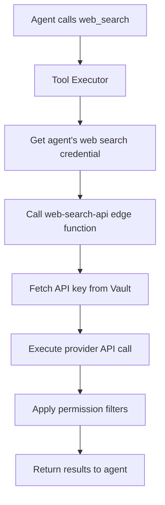

# Web Search Integration

## Overview

The web search integration enables agents to perform internet searches using multiple provider APIs. The system supports Serper API, SerpAPI, and Brave Search, with unified handling through a single edge function.

## Supported Providers

### Serper API
- **Provider Name**: `serper_api`
- **API Endpoint**: `https://google.serper.dev/search`
- **Documentation**: https://serper.dev/docs
- **Key Features**: Google search results, rich snippets, knowledge graph

### SerpAPI
- **Provider Name**: `serpapi`
- **API Endpoint**: `https://serpapi.com/search`
- **Documentation**: https://serpapi.com/docs
- **Key Features**: Multiple search engines, location-based results, pagination

### Brave Search
- **Provider Name**: `brave_search`
- **API Endpoint**: `https://api.search.brave.com/res/v1/web/search`
- **Documentation**: https://brave.com/search/api/
- **Key Features**: Privacy-focused, independent index, web and news search

## Architecture

### Database Configuration

```sql
-- Provider records in oauth_providers table
INSERT INTO oauth_providers (name, display_name, provider_type) VALUES
  ('serper_api', 'Serper API', 'api_key'),
  ('serpapi', 'SerpAPI', 'api_key'),
  ('brave_search', 'Brave Search', 'api_key');
```

### Credential Storage

API keys are stored in Supabase Vault:

```typescript
// Storage in user_oauth_connections
{
  user_id: 'user-uuid',
  provider_id: 'serper-api-provider-uuid',
  credential_type: 'api_key',
  vault_access_token_id: 'vault-uuid', // API key stored here
  connection_status: 'connected'
}
```

## Edge Function Implementation

### Function: `web-search-api`

Location: `supabase/functions/web-search-api/index.ts`

```typescript
import { serve } from 'https://deno.land/std@0.168.0/http/server.ts';
import { createClient } from 'https://esm.sh/@supabase/supabase-js@2.39.0';

serve(async (req) => {
  const { query, provider, connectionId, agentId } = await req.json();
  
  // 1. Verify agent permissions
  const hasPermission = await checkAgentPermission(agentId, connectionId);
  if (!hasPermission) {
    return new Response(
      JSON.stringify({ error: 'Agent lacks search permission' }),
      { status: 403 }
    );
  }
  
  // 2. Get API key from Vault
  const apiKey = await getApiKeyFromVault(connectionId);
  
  // 3. Execute search based on provider
  const results = await executeSearch(provider, apiKey, query);
  
  // 4. Apply permission-based filtering
  const filteredResults = await applyPermissionFilters(
    results, 
    agentId, 
    connectionId
  );
  
  return new Response(
    JSON.stringify({ results: filteredResults }),
    { headers: { 'Content-Type': 'application/json' } }
  );
});
```

### Provider-Specific Search Implementation

#### Serper API

```typescript
async function searchWithSerper(apiKey: string, query: string) {
  const response = await fetch('https://google.serper.dev/search', {
    method: 'POST',
    headers: {
      'X-API-KEY': apiKey,
      'Content-Type': 'application/json'
    },
    body: JSON.stringify({
      q: query,
      num: 10,
      gl: 'us',
      hl: 'en'
    })
  });
  
  const data = await response.json();
  
  return {
    organic: data.organic || [],
    knowledgeGraph: data.knowledgeGraph || null,
    answerBox: data.answerBox || null,
    searchParameters: data.searchParameters
  };
}
```

#### SerpAPI

```typescript
async function searchWithSerpAPI(apiKey: string, query: string) {
  const params = new URLSearchParams({
    api_key: apiKey,
    q: query,
    engine: 'google',
    num: 10,
    gl: 'us',
    hl: 'en'
  });
  
  const response = await fetch(`https://serpapi.com/search?${params}`);
  const data = await response.json();
  
  return {
    organic: data.organic_results || [],
    knowledgeGraph: data.knowledge_graph || null,
    answerBox: data.answer_box || null,
    searchParameters: data.search_parameters
  };
}
```

#### Brave Search

```typescript
async function searchWithBrave(apiKey: string, query: string) {
  const params = new URLSearchParams({
    q: query,
    count: 10,
    country: 'us',
    search_lang: 'en',
    safesearch: 'moderate'
  });
  
  const response = await fetch(
    `https://api.search.brave.com/res/v1/web/search?${params}`,
    {
      headers: {
        'X-Subscription-Token': apiKey,
        'Accept': 'application/json'
      }
    }
  );
  
  const data = await response.json();
  
  return {
    organic: data.web?.results || [],
    infobox: data.infobox || null,
    discussions: data.discussions || null,
    searchParameters: { query: data.query }
  };
}
```

### Unified Response Format

All providers return results in a standardized format:

```typescript
interface SearchResult {
  title: string;
  url: string;
  snippet: string;
  position: number;
  domain: string;
  date?: string;
  thumbnail?: string;
}

interface SearchResponse {
  results: SearchResult[];
  totalResults?: number;
  searchTime?: number;
  knowledgeGraph?: any;
  answerBox?: any;
  relatedSearches?: string[];
}
```

## Frontend Integration

### Setup Component

```typescript
// In IntegrationSetupModal.tsx
const handleWebSearchSetup = async (apiKey: string, provider: string) => {
  // Store API key in Vault
  const { data: vaultData } = await supabase.rpc('vault_encrypt', {
    secret: apiKey,
    key_id: crypto.randomUUID()
  });
  
  // Create connection record
  const { data: connection } = await supabase
    .from('user_oauth_connections')
    .insert({
      user_id: user.id,
      provider_id: getProviderId(provider),
      credential_type: 'api_key',
      vault_access_token_id: vaultData.vault_id,
      connection_status: 'connected'
    });
  
  return connection;
};
```

### Search Execution Hook

```typescript
// useWebSearch.ts
export function useWebSearch() {
  const [loading, setLoading] = useState(false);
  const [error, setError] = useState<string | null>(null);
  
  const search = async (
    query: string,
    connectionId: string,
    agentId?: string
  ) => {
    setLoading(true);
    setError(null);
    
    try {
      const { data, error } = await supabase.functions.invoke(
        'web-search-api',
        {
          body: {
            query,
            connectionId,
            agentId
          }
        }
      );
      
      if (error) throw error;
      return data.results;
    } catch (err) {
      setError(err.message);
      throw err;
    } finally {
      setLoading(false);
    }
  };
  
  return { search, loading, error };
}
```

## Agent Tool Use

### Function Calling Format

Agents can call web search through function calling:

```json
{
  "name": "web_search",
  "description": "Search the web for information",
  "parameters": {
    "type": "object",
    "properties": {
      "query": {
        "type": "string",
        "description": "The search query"
      },
      "num_results": {
        "type": "integer",
        "description": "Number of results to return",
        "default": 10
      }
    },
    "required": ["query"]
  }
}
```

### Execution Flow



## Permission Controls

### Available Permissions

```typescript
interface WebSearchPermissions {
  enabled: boolean;
  max_queries_per_day: number;
  max_results_per_query: number;
  safe_search: boolean;
  allowed_domains: string[];
  blocked_domains: string[];
  geo_location: string;
  search_depth: 'basic' | 'detailed' | 'comprehensive';
}
```

### Permission Enforcement

```typescript
async function applyPermissionFilters(
  results: SearchResult[],
  agentId: string,
  connectionId: string
): Promise<SearchResult[]> {
  const permissions = await getAgentPermissions(agentId, connectionId);
  
  let filtered = results;
  
  // Apply max results limit
  if (permissions.max_results_per_query) {
    filtered = filtered.slice(0, permissions.max_results_per_query);
  }
  
  // Apply domain filters
  if (permissions.allowed_domains?.length > 0) {
    filtered = filtered.filter(r => 
      permissions.allowed_domains.some(d => r.domain.includes(d))
    );
  }
  
  if (permissions.blocked_domains?.length > 0) {
    filtered = filtered.filter(r => 
      !permissions.blocked_domains.some(d => r.domain.includes(d))
    );
  }
  
  return filtered;
}
```

## Rate Limiting

### Provider Limits

| Provider | Free Tier | Paid Tier |
|----------|-----------|-----------|
| Serper API | 100/month | 2,500+/month |
| SerpAPI | 100/month | 5,000+/month |
| Brave Search | 2,000/month | 10,000+/month |

### Implementation

```typescript
// Rate limiting in edge function
const rateLimits = new Map<string, RateLimit>();

async function checkRateLimit(
  connectionId: string,
  provider: string
): Promise<boolean> {
  const key = `${connectionId}:${provider}`;
  const limit = rateLimits.get(key);
  
  if (!limit) {
    rateLimits.set(key, {
      count: 1,
      resetAt: Date.now() + 86400000 // 24 hours
    });
    return true;
  }
  
  if (Date.now() > limit.resetAt) {
    limit.count = 1;
    limit.resetAt = Date.now() + 86400000;
    return true;
  }
  
  const maxQueries = getMaxQueriesForProvider(provider);
  if (limit.count >= maxQueries) {
    return false;
  }
  
  limit.count++;
  return true;
}
```

## Error Handling

### Common Errors

1. **Invalid API Key**
```typescript
if (response.status === 401) {
  // Update connection status
  await supabase
    .from('user_oauth_connections')
    .update({ connection_status: 'expired' })
    .eq('id', connectionId);
  
  throw new Error('Invalid API key. Please reconnect your search provider.');
}
```

2. **Rate Limit Exceeded**
```typescript
if (response.status === 429) {
  const resetTime = response.headers.get('X-RateLimit-Reset');
  throw new Error(
    `Rate limit exceeded. Try again ${
      resetTime ? `at ${new Date(resetTime * 1000).toLocaleString()}` : 'later'
    }.`
  );
}
```

3. **Provider Unavailable**
```typescript
if (response.status >= 500) {
  throw new Error(
    `${provider} is temporarily unavailable. Please try again later.`
  );
}
```

## Testing

### Manual Testing

```javascript
// scripts/test_web_search.js
const { createClient } = require('@supabase/supabase-js');

const supabase = createClient(
  process.env.SUPABASE_URL,
  process.env.SUPABASE_ANON_KEY
);

async function testWebSearch() {
  const { data, error } = await supabase.functions.invoke(
    'web-search-api',
    {
      body: {
        query: 'OpenAI GPT-4',
        provider: 'serper_api',
        connectionId: 'your-connection-id'
      }
    }
  );
  
  console.log('Results:', data);
  if (error) console.error('Error:', error);
}

testWebSearch();
```

### Unit Tests

```typescript
// tests/web-search.test.ts
describe('Web Search Integration', () => {
  it('should search with Serper API', async () => {
    const results = await searchWithSerper(
      'test-api-key',
      'test query'
    );
    expect(results.organic).toBeDefined();
    expect(Array.isArray(results.organic)).toBe(true);
  });
  
  it('should handle rate limiting', async () => {
    const limited = await checkRateLimit('conn-1', 'serper_api');
    expect(limited).toBe(true);
    
    // Simulate hitting limit
    for (let i = 0; i < 100; i++) {
      await checkRateLimit('conn-1', 'serper_api');
    }
    
    const exceeded = await checkRateLimit('conn-1', 'serper_api');
    expect(exceeded).toBe(false);
  });
});
```

## Best Practices

1. **Cache Results**: Implement caching for identical queries within a time window
2. **Fallback Providers**: Configure backup providers for reliability
3. **Query Optimization**: Clean and optimize queries before sending to API
4. **Result Deduplication**: Remove duplicate results across providers
5. **Monitoring**: Track API usage and success rates
6. **Cost Management**: Implement spending limits per user/agent

## Migration Guide

### From Legacy System

```typescript
// Old system (direct API calls)
const results = await fetch('https://api.serper.dev/search', {
  headers: { 'X-API-KEY': process.env.SERPER_API_KEY }
});

// New system (unified edge function)
const { data } = await supabase.functions.invoke('web-search-api', {
  body: { query, connectionId }
});
```

### Adding New Providers

1. Add provider to `oauth_providers` table
2. Implement search function in edge function
3. Add provider option to frontend setup modal
4. Update documentation

## Future Enhancements

1. **Multi-Provider Search**: Aggregate results from multiple providers
2. **Search History**: Track and analyze search patterns
3. **Smart Caching**: ML-based cache prediction
4. **Custom Ranking**: User-defined result ranking algorithms
5. **Semantic Search**: Enhanced query understanding
6. **Visual Search**: Support for image-based searches
