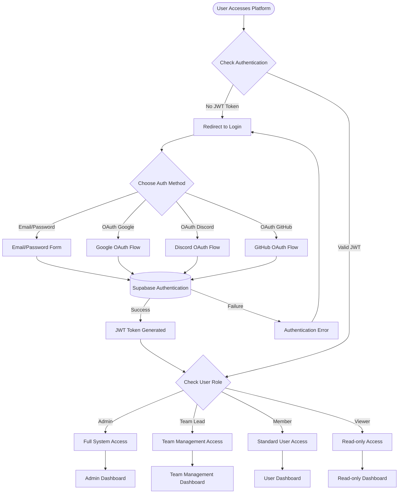
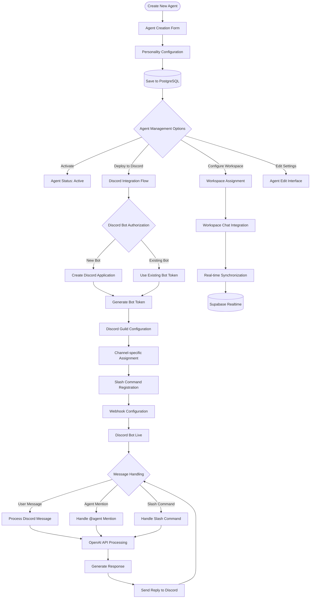
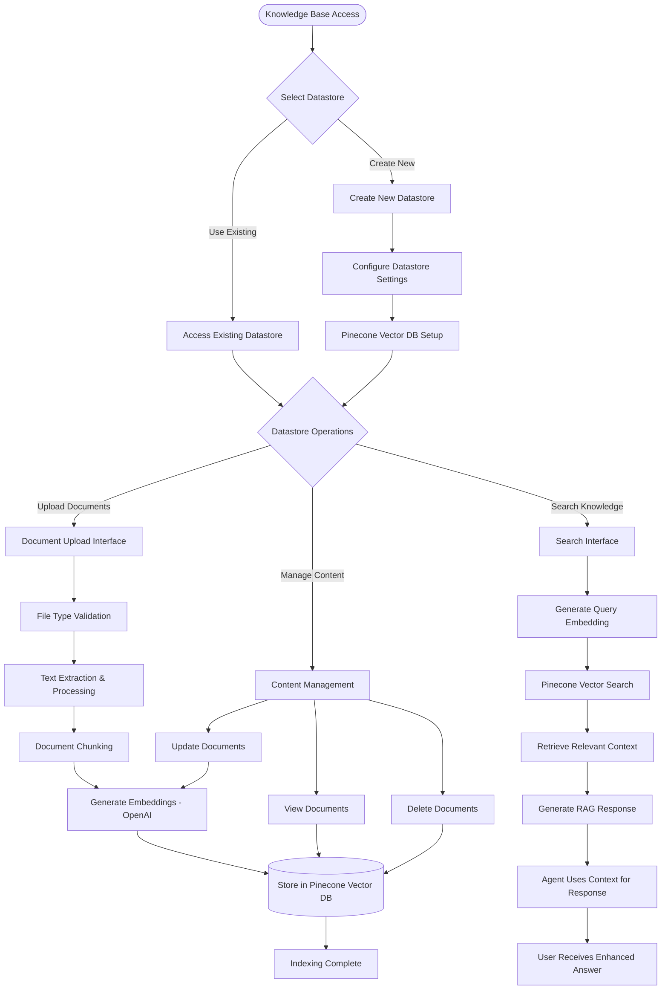
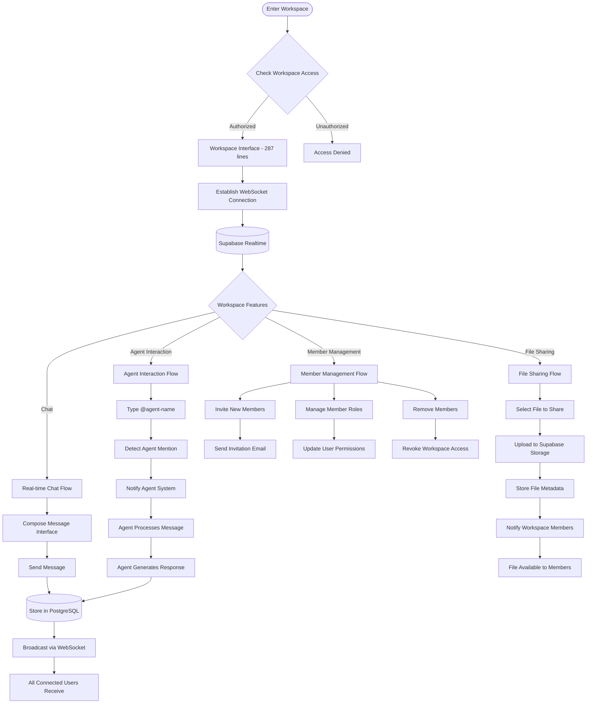
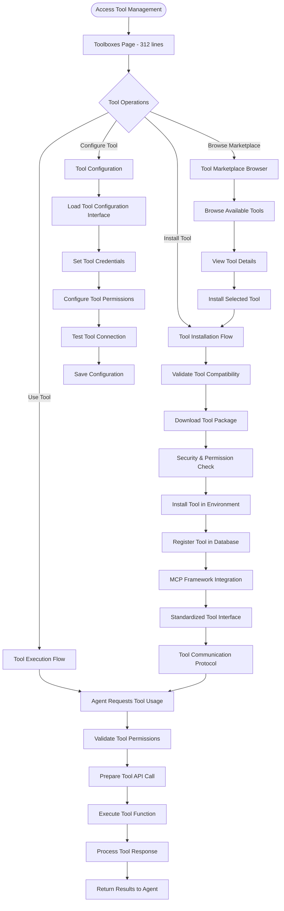

# Agentopia Application Flowchart
**Version:** 2.0  
**Date:** May 11, 2025  
**Architecture Analysis Date:** May 11, 2025  
**Technology Stack:** React 18 + TypeScript + Supabase  

This document provides a comprehensive flowchart of user journeys and system architecture for Agentopia's modern web application.

## Main Application Flow

```mermaid
flowchart TD
    Start([User Access Platform]) --> Auth{Authentication Status}
    
    Auth -->|Not Authenticated| LoginPage[Login Page - Supabase Auth]
    Auth -->|Authenticated| Dashboard[Dashboard Page - 224 lines]
    
    LoginPage --> AuthOptions{Authentication Method}
    AuthOptions -->|Email/Password| EmailAuth[Email Authentication]
    AuthOptions -->|OAuth| OAuthFlow[OAuth Flow]
    
    OAuthFlow --> GoogleAuth[Google OAuth]
    OAuthFlow --> DiscordAuth[Discord OAuth]
    OAuthFlow --> GitHubAuth[GitHub OAuth]
    
    EmailAuth --> Supabase[(Supabase Auth)]
    GoogleAuth --> Supabase
    DiscordAuth --> Supabase
    GitHubAuth --> Supabase
    
    Supabase --> Dashboard
    
    Dashboard --> Navigation{Navigation Choice}
    
    Navigation -->|Agents| AgentsFlow[Agent Management Flow]
    Navigation -->|Workspaces| WorkspaceFlow[Workspace Collaboration Flow]
    Navigation -->|Teams| TeamsFlow[Team Management Flow]
    Navigation -->|Datastores| DatastoreFlow[Knowledge Base Flow]
    Navigation -->|Toolboxes| ToolboxFlow[Tool Management Flow]
    Navigation -->|Admin| AdminFlow[Administrative Flow]
    
    %% Agent Management Flow
    AgentsFlow --> AgentsPage[Agents Page - 298 lines]
    AgentsPage --> AgentActions{Agent Actions}
    AgentActions -->|Create New| AgentCreate[Create Agent Form]
    AgentActions -->|Edit Existing| AgentEdit[Agent Edit - 531 lines ⚠️]
    AgentActions -->|View List| AgentList[Agent List View]
    AgentActions -->|Deploy to Discord| DiscordDeploy[Discord Bot Deployment]
    
    %% Workspace Collaboration Flow
    WorkspaceFlow --> WorkspacePage[Workspace Page - 287 lines]
    WorkspacePage --> WorkspaceActions{Workspace Features}
    WorkspaceActions -->|Real-time Chat| ChatInterface[Chat Interface - WebSocket]
    WorkspaceActions -->|File Sharing| FileUpload[File Upload & Sharing]
    WorkspaceActions -->|Member Management| MemberMgmt[Member Management]
    WorkspaceActions -->|Agent Interaction| AgentMention[Agent @mention System]
    
    %% Knowledge Base Flow
    DatastoreFlow --> DatastorePage[Datastores Page - 664 lines 🔴]
    DatastorePage --> DatastoreActions{Datastore Operations}
    DatastoreActions -->|Upload Documents| DocUpload[Document Upload]
    DatastoreActions -->|Vector Search| VectorSearch[Pinecone Vector Search]
    DatastoreActions -->|RAG Processing| RAGSystem[RAG Implementation]
    
    %% Tool Management Flow
    ToolboxFlow --> ToolboxPage[Toolboxes Page - 312 lines]
    ToolboxPage --> ToolActions{Tool Operations}
    ToolActions -->|Install Tools| ToolInstall[MCP Tool Installation]
    ToolActions -->|Configure Tools| ToolConfig[Tool Configuration]
    ToolActions -->|Marketplace| ToolMarketplace[Tool Marketplace]
```

## Authentication & Authorization Flow

## Agent Lifecycle & Discord Integration Flow

## Knowledge Base & RAG System Flow

## Workspace Collaboration & Real-time Features Flow

## Tool Integration & MCP Framework Flow

## System Architecture & Data Flow

```mermaid
flowchart TD
    Frontend[React 18 Frontend] --> APILayer[Supabase API Layer]
    
    APILayer --> Database[(PostgreSQL 14+ with pgvector)]
    APILayer --> Auth[Supabase Auth]
    APILayer --> EdgeFunctions[Supabase Edge Functions]
    APILayer --> Realtime[Supabase Realtime]
    APILayer --> Storage[Supabase Storage]
    
    EdgeFunctions --> ExternalAPIs{External API Integrations}
    
    ExternalAPIs --> OpenAI[OpenAI API - LLM Processing]
    ExternalAPIs --> Pinecone[Pinecone Vector Database]
    ExternalAPIs --> Discord[Discord API]
    ExternalAPIs --> MCPTools[MCP Tool Ecosystem]
    
    Database --> Tables{Database Tables}
    Tables --> UserProfiles[user_profiles]
    Tables --> Agents[agents]
    Tables --> Workspaces[workspaces]
    Tables --> ChatMessages[chat_messages]
    Tables --> Datastores[datastores]
    Tables --> Tools[tools]
    
    Frontend --> Components{React Components}
    Components --> DashboardComp[Dashboard - 224 lines ✅]
    Components --> AgentsComp[Agents - 298 lines ✅]
    Components --> AgentEditComp[AgentEdit - 531 lines ⚠️]
    Components --> WorkspaceComp[Workspace - 287 lines ✅]
    Components --> DatastoreComp[Datastores - 664 lines 🔴]
    Components --> ToolboxComp[Toolboxes - 312 lines ✅]
    
    %% Infrastructure Layer
    Database --> Infrastructure[Infrastructure Layer]
    Infrastructure --> DigitalOcean[DigitalOcean Hosting]
    Infrastructure --> PM2[PM2 Process Management]
    Infrastructure --> Docker[Docker Containers]
    Infrastructure --> LoadBalancer[Load Balancer]
```

## Error Handling & Monitoring Flow

```mermaid
flowchart TD
    UserAction([User Performs Action]) --> TryOperation{Execute Operation}
    
    TryOperation -->|Success| SuccessResponse[Return Success Response]
    TryOperation -->|Error| ErrorHandling[Error Handling System]
    
    ErrorHandling --> ErrorType{Error Type Classification}
    
    ErrorType -->|Authentication| AuthError[Authentication Error]
    ErrorType -->|Authorization| AuthZError[Authorization Error]
    ErrorType -->|Validation| ValidationError[Input Validation Error]
    ErrorType -->|Network| NetworkError[Network/API Error]
    ErrorType -->|System| SystemError[System/Server Error]
    
    AuthError --> LoginRedirect[Redirect to Login]
    AuthZError --> AccessDenied[Show Access Denied]
    ValidationError --> ValidationMessage[Show Validation Message]
    NetworkError --> RetryMechanism[Retry Mechanism]
    SystemError --> SystemAlert[System Alert]
    
    %% Logging Flow (Currently Missing - Critical Issue)
    ErrorHandling --> LoggingSystem[Logging System - ⚠️ MISSING]
    LoggingSystem --> LogTypes{Log Types}
    LogTypes --> ErrorLogs[Error Logs]
    LogTypes --> AccessLogs[Access Logs]
    LogTypes --> PerformanceLogs[Performance Logs]
    LogTypes --> AuditLogs[Audit Logs]
    
    ErrorLogs --> LogStorage[(Log Storage - NEEDED)]
    AccessLogs --> LogStorage
    PerformanceLogs --> LogStorage
    AuditLogs --> LogStorage
    
    LogStorage --> MonitoringDashboard[Monitoring Dashboard - NEEDED]
    MonitoringDashboard --> AlertSystem[Alert System - NEEDED]
```

## Critical Issues Identified in Current Flow

### 🔴 High Priority Issues
1. **Missing Logging Infrastructure**
   - No comprehensive error tracking
   - Limited debugging capabilities
   - No performance monitoring

2. **Large Component Files**
   - DatastoresPage.tsx: 664 lines (violates 500-line rule)
   - AgentEdit.tsx: 531 lines (approaching limit)
   - Need immediate refactoring

3. **Architecture Transition**
   - Tool management patterns inconsistent
   - Migration from per-agent to shared model

### Architecture Strengths
1. **Modern React 18 + TypeScript Stack**
2. **Supabase Real-time Capabilities**
3. **Comprehensive Discord Integration**
4. **Vector Database Integration with Pinecone**
5. **OAuth Authentication System**

## Summary

This flowchart represents the current operational state of Agentopia as of May 11, 2025. The platform successfully implements:

- **Authentication & Authorization**: Full OAuth integration with role-based access
- **Real-time Collaboration**: WebSocket-based workspace features
- **AI Agent Management**: Complete CRUD operations with Discord deployment
- **Knowledge Base**: RAG system with Pinecone vector database
- **Tool Integration**: MCP framework for external tool connectivity

**Critical Next Steps:**
1. Implement comprehensive logging infrastructure
2. Refactor large component files
3. Complete tool architecture transition
4. Enhance monitoring and alerting systems

**System Status:** 70% MVP Complete, Production-Ready with Critical Issues to Address